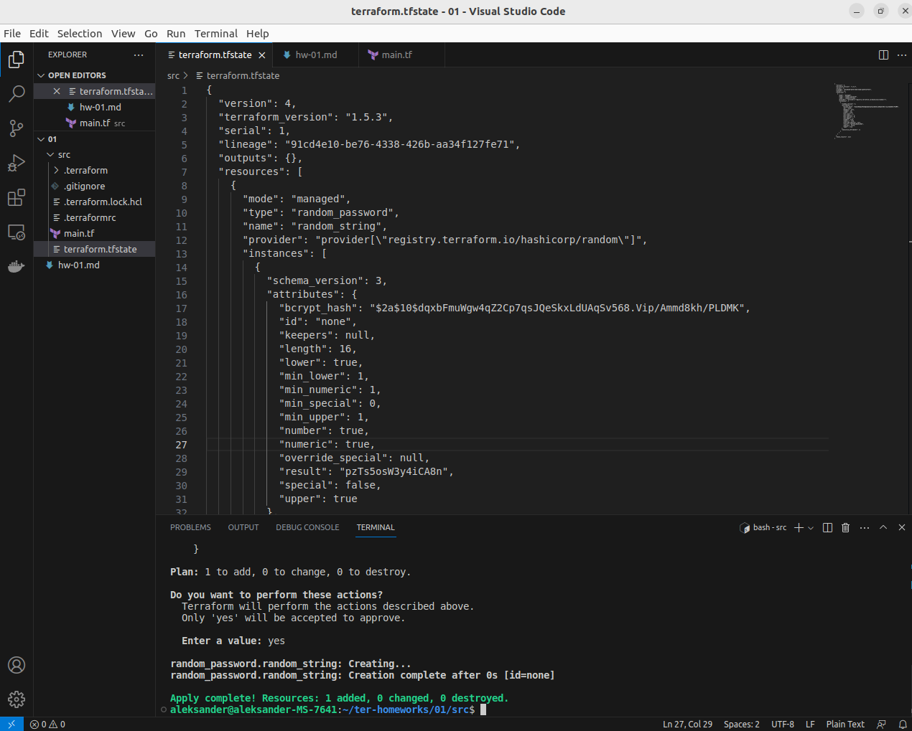

# Домашнее задание к занятию «Введение в Terraform»

### Цель задания

1. Установить и настроить Terrafrom.
2. Научиться использовать готовый код.

------

### Чеклист готовности к домашнему заданию

1. Скачайте и установите актуальную версию **terraform** >=1.4.X . Приложите скриншот вывода команды ```terraform --version```.
2. Скачайте на свой ПК данный git репозиторий. Исходный код для выполнения задания расположен в директории **01/src**.
3. Убедитесь, что в вашей ОС установлен docker.
4. Зарегистрируйте аккаунт на сайте https://hub.docker.com/, выполните команду docker login и введите логин/пароль.

------

### Инструменты и дополнительные материалы, которые пригодятся для выполнения задания

1. Репозиторий с ссылкой на зеркало для установки и настройки Terraform  [ссылка](https://github.com/netology-code/devops-materials).
2. Установка docker [ссылка](https://docs.docker.com/engine/install/ubuntu/). 
------

### Задание 1

1. Перейдите в каталог [**src**](https://github.com/netology-code/ter-homeworks/tree/main/01/src). Скачайте все необходимые зависимости, использованные в проекте. 
2. Изучите файл **.gitignore**. В каком terraform файле согласно этому .gitignore допустимо сохранить личную, секретную информацию?
3. Выполните код проекта. Найдите  в State-файле секретное содержимое созданного ресурса **random_password**, пришлите в качестве ответа конкретный ключ и его значение.
4. Раскомментируйте блок кода, примерно расположенный на строчках 29-42 файла **main.tf**.
Выполните команду ```terraform validate```. Объясните в чем заключаются намеренно допущенные ошибки? Исправьте их.
5. Выполните код. В качестве ответа приложите вывод команды ```docker ps```
6. Замените имя docker-контейнера в блоке кода на ```hello_world```, выполните команду ```terraform apply -auto-approve```.
7. Объясните своими словами, в чем может быть опасность применения ключа  ```-auto-approve``` ? В качестве ответа дополнительно приложите вывод команды ```docker ps```
8. Уничтожьте созданные ресурсы с помощью **terraform**. Убедитесь, что все ресурсы удалены. Приложите содержимое файла **terraform.tfstate**. 
9. Объясните, почему при этом не был удален docker образ **nginx:latest** ? Ответ подкрепите выдержкой из документации провайдера.


### Решение 1

1. Запускаем команду terraform init

- Вывод данной команды
```
aleksander@aleksander-MS-7641:~/ter-homeworks/01/src$ terraform init

Initializing the backend...

Initializing provider plugins...
- Finding kreuzwerker/docker versions matching "~> 3.0.1"...
- Finding latest version of hashicorp/random...
- Installing kreuzwerker/docker v3.0.2...
- Installed kreuzwerker/docker v3.0.2 (unauthenticated)
- Installing hashicorp/random v3.5.1...
- Installed hashicorp/random v3.5.1 (unauthenticated)

Terraform has created a lock file .terraform.lock.hcl to record the provider
selections it made above. Include this file in your version control repository
so that Terraform can guarantee to make the same selections by default when
you run "terraform init" in the future.

╷
│ Warning: Incomplete lock file information for providers
│ 
│ Due to your customized provider installation methods, Terraform was forced to calculate lock file checksums locally for the following
│ providers:
│   - hashicorp/random
│   - kreuzwerker/docker
│ 
│ The current .terraform.lock.hcl file only includes checksums for linux_amd64, so Terraform running on another platform will fail to
│ install these providers.
│ 
│ To calculate additional checksums for another platform, run:
│   terraform providers lock -platform=linux_amd64
│ (where linux_amd64 is the platform to generate)
╵

Terraform has been successfully initialized!

You may now begin working with Terraform. Try running "terraform plan" to see
any changes that are required for your infrastructure. All Terraform commands
should now work.

If you ever set or change modules or backend configuration for Terraform,
rerun this command to reinitialize your working directory. If you forget, other
commands will detect it and remind you to do so if necessary.
```
2. Согласно файлу .gitignore допустимо хранить личную, секретную информацию в terraform файле personal.auto.tfvars

3. Запускаем команду terraform apply

- Вывод данной команды
```
aleksander@aleksander-MS-7641:~/ter-homeworks/01/src$ terraform apply

Terraform used the selected providers to generate the following execution plan. Resource actions are indicated with the
following symbols:
  + create

Terraform will perform the following actions:

  # random_password.random_string will be created
  + resource "random_password" "random_string" {
      + bcrypt_hash = (sensitive value)
      + id          = (known after apply)
      + length      = 16
      + lower       = true
      + min_lower   = 1
      + min_numeric = 1
      + min_special = 0
      + min_upper   = 1
      + number      = true
      + numeric     = true
      + result      = (sensitive value)
      + special     = false
      + upper       = true
    }

Plan: 1 to add, 0 to change, 0 to destroy.

Do you want to perform these actions?
  Terraform will perform the actions described above.
  Only 'yes' will be accepted to approve.

  Enter a value: yes

random_password.random_string: Creating...
random_password.random_string: Creation complete after 0s [id=none]

Apply complete! Resources: 1 added, 0 changed, 0 destroyed.
```

В результате выполнения данной команды создается файл terraform.tfstate
В переменную result в этом файле записывается созданный пароль ("result": "pzTs5osW3y4iCA8n") в результате выполненного кода main.tf

```
{
  "version": 4,
  "terraform_version": "1.5.3",
  "serial": 1,
  "lineage": "91cd4e10-be76-4338-426b-aa34f127fe71",
  "outputs": {},
  "resources": [
    {
      "mode": "managed",
      "type": "random_password",
      "name": "random_string",
      "provider": "provider[\"registry.terraform.io/hashicorp/random\"]",
      "instances": [
        {
          "schema_version": 3,
          "attributes": {
            "bcrypt_hash": "$2a$10$dqxbFmuWgw4qZ2Cp7qsJQeSkxLdUAqSv568.Vip/Ammd8kh/PLDMK",
            "id": "none",
            "keepers": null,
            "length": 16,
            "lower": true,
            "min_lower": 1,
            "min_numeric": 1,
            "min_special": 0,
            "min_upper": 1,
            "number": true,
            "numeric": true,
            "override_special": null,
            "result": "pzTs5osW3y4iCA8n",
            "special": false,
            "upper": true
          },
          "sensitive_attributes": []
        }
      ]
    }
  ],
  "check_results": null
}
```


- скриншот файла terraform.tfstate.
<p align="center">
  
</p>

4. Раскомментируем блок кода файла **main.tf** и выполняем команду ```terraform validate```

- Получаем следующий вывод
```
aleksander@aleksander-MS-7641:~/ter-homeworks/01/src$ terraform validate
╷
│ Error: Missing name for resource
│ 
│   on main.tf line 24, in resource "docker_image":
│   24: resource "docker_image" {
│ 
│ All resource blocks must have 2 labels (type, name).
╵
╷
│ Error: Invalid resource name
│ 
│   on main.tf line 29, in resource "docker_container" "1nginx":
│   29: resource "docker_container" "1nginx" {
│ 
│ A name must start with a letter or underscore and may contain only letters, digits, underscores, and dashes.
```
Данный вывод говорит нам что на 24 строке отсутствует имя ресурса, дописываем имя ресурса "nginx", в результате после исправлений получается следующий код в  **main.tf**
```
resource "docker_image" "nginx" {
  name         = "nginx:latest"
  keep_locally = true
}
```

На 29 строке terraform говорит нам что нет такого имени ресурса, вносим исправления в код

```
resource "docker_container" "nginx" {
  image = docker_image.nginx.image_id
  name  = "example_${random_password.random_string_FAKE.resulT}"

  ports {
    internal = 80
    external = 8000
  }
}
```
Выполняем команду terraform validate
```
aleksander@aleksander-MS-7641:~/ter-homeworks/01/src$ terraform validate
╷
│ Error: Reference to undeclared resource
│ 
│   on main.tf line 31, in resource "docker_container" "nginx":
│   31:   name  = "example_${random_password.random_string_FAKE.resulT}"
│ 
│ A managed resource "random_password" "random_string_FAKE" has not been declared in the root module.
```
Данный вывод сообщает что нет ресурса с type и name соответственно "random_password" "random_string_FAKE", вносим корректировку.

```
resource "docker_container" "nginx" {
  image = docker_image.nginx.image_id
  name  = "example_${random_password.random_string.resulT}"

  ports {
    internal = 80
    external = 8000
  }
}

```

Выполняем команду terraform validate
```
aleksander@aleksander-MS-7641:~/ter-homeworks/01/src$ terraform validate
╷
│ Error: Unsupported attribute
│ 
│   on main.tf line 31, in resource "docker_container" "nginx":
│   31:   name  = "example_${random_password.random_string.resulT}"
│ 
│ This object has no argument, nested block, or exported attribute named "resulT". Did you mean "result"?
```

Данный вывод сообщает что не  существует атрибута с именем "resulT", все букы должены быть в нижнем регистре вносим корректировку как предлагает terraform (Did you mean "result"?).

Выполняем команду terraform validate
```
aleksander@aleksander-MS-7641:~/ter-homeworks/01/src$ terraform validate
Success! The configuration is valid.
```
Теперь конфигурация валидна.

5. Выполняем команду terraform apply и затем docker ps

Получаем следующий вывод 
<p align="center">
  
</p>

6. Чтобы автоматически утвердить план, который будет сгенерирован terraform apply командой, нам нужно передать ей -auto-approve флаг в качестве аргумента при вводе команды. 
Заменяем имя docker-контейнера в блоке кода на ```hello_world```, и выполняем команду ```terraform apply -auto-approve```, затем docker ps
получаем следующий вывод 
<p align="center">
  
</p>

7. При использовании флага -auto-approve мы не имеем возможности проверить выполняемые действия terraform apply и при выявлении ошибок отказаться от выполнения команды.

8. Выполняем команду terraform destroy
Получаем следующий вывод 
<p align="center">
  
</p>

Файл **terraform.tfstate** при этом очищается (становится пустым)
<p align="center">
  
</p>

9. При выплнении terraform destroy не был удален docker образ **nginx:latest** потому что в кофигурации файла main.tf установлен параметр keep_locally = true
https://docs.comcloud.xyz/providers/kreuzwerker/docker/latest/docs/resources/registry_image

------

## Дополнительные задания (со звездочкой*)

**Настоятельно рекомендуем выполнять все задания под звёздочкой.**   Их выполнение поможет глубже разобраться в материале.   
Задания под звёздочкой дополнительные (необязательные к выполнению) и никак не повлияют на получение вами зачета по этому домашнему заданию. 

### Задание 2*

1. Изучите в документации provider [**Virtualbox**](https://docs.comcloud.xyz/providers/shekeriev/virtualbox/latest/docs) от 
shekeriev.
2. Создайте с его помощью любую виртуальную машину. Чтобы не использовать VPN советуем выбрать любой образ с расположением в github из [**списка**](https://www.vagrantbox.es/)

В качестве ответа приложите plan для создаваемого ресурса и скриншот созданного в VB ресурса. 

### Решение 2

- Вывод команды terraform plan:
<p align="center">
  
</p>

- Cкриншот созданного в VB ресурса:
<p align="center">
  
</p>

------

### Правила приема работы

Домашняя работа оформляется в отдельном GitHub репозитории в файле README.md.   
Выполненное домашнее задание пришлите ссылкой на .md-файл в вашем репозитории.

### Критерии оценки

Зачёт:

* выполнены все задания;
* ответы даны в развёрнутой форме;
* приложены соответствующие скриншоты и файлы проекта;
* в выполненных заданиях нет противоречий и нарушения логики.

На доработку:

* задание выполнено частично или не выполнено вообще;
* в логике выполнения заданий есть противоречия и существенные недостатки. 
