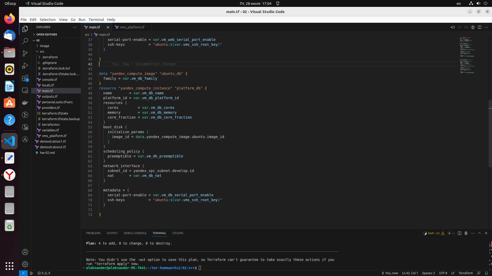

# Домашнее задание к занятию «Основы Terraform. Yandex Cloud»

### Цель задания

1. Создать свои ресурсы в облаке Yandex Cloud с помощью Terraform.
2. Освоить работу с переменными Terraform.


### Чеклист готовности к домашнему заданию

1. Зарегистрирован аккаунт в Yandex Cloud. Использован промокод на грант.
2. Установлен инструмент Yandex Cli.
3. Исходный код для выполнения задания расположен в директории [**02/src**](https://github.com/netology-code/ter-homeworks/tree/main/02/src).


### Задание 0

1. Ознакомьтесь с [документацией к security-groups в Yandex Cloud](https://cloud.yandex.ru/docs/vpc/concepts/security-groups?from=int-console-help-center-or-nav).
2. Запросите preview доступ к данному функционалу в ЛК Yandex Cloud. Обычно его выдают в течении 24-х часов.
https://console.cloud.yandex.ru/folders/<ваш cloud_id>/vpc/security-groups.   
Этот функционал понадобится к следующей лекции. 


### Задание 1
В качестве ответа всегда полностью прикладываете ваш terraform-код в git!

1. Изучите проект. В файле variables.tf объявлены переменные для yandex provider.
2. Переименуйте файл personal.auto.tfvars_example в personal.auto.tfvars. Заполните переменные (идентификаторы облака, токен доступа). Благодаря .gitignore этот файл не попадет в публичный репозиторий. **Вы можете выбрать иной способ безопасно передать секретные данные в terraform.**
3. Сгенерируйте или используйте свой текущий ssh ключ. Запишите его открытую часть в переменную **vms_ssh_root_key**.
4. Инициализируйте проект, выполните код. Исправьте намеренно допущенные синтаксические ошибки. Ищите внимательно, посимвольно. Ответьте в чем заключается их суть? 
5. Ответьте, как в процессе обучения могут пригодиться параметры```preemptible = true``` и ```core_fraction=5``` в параметрах ВМ? Ответ в документации Yandex cloud.

В качестве решения приложите:
- скриншот ЛК Yandex Cloud с созданной ВМ,
- скриншот успешного подключения к консоли ВМ через ssh(к OS ubuntu необходимо подключаться под пользователем ubuntu: "ssh ubuntu@vm_ip_address"),
- ответы на вопросы.

### Решение 1

4. 
- Ошибка №1 допущена в файле main.tf, ошибка в наименовании параметра platform_id = "standart-v4", первая ошибка это описка (заменяем standart на standard), вторая ошибка неправильно указана версия (заменяем v4 на v3) правильно platform_id = "standard-v3"
<p align="center">
  
</p> 

- Ошибка №2 допущена в файле main.tf в параметре core_fraction = 5 (базовый уровень производительности vCPU.), исправляем на core_fraction = 20 (выбранным стандартом поддерживаются значения core fractions: 20, 50, 100)
<p align="center">
  
</p> 

- Ошибка №3 допущена в файле main.tf в параметре cores         = 1 (количество ядер, доступных виртуальной машине),  исправляем на cores         = 2 выбранным стандартом поддерживаются значения cores: 2, 4)
<p align="center">
  
</p> 

- скриншот ЛК Yandex Cloud с созданной ВМ
<p align="center">
  
</p> 

- скриншот успешного подключения к консоли ВМ через ssh
<p align="center">
  
</p> 

5. Параметр preemptible = true означает что виртуальная машина может быть принудительно остановлена в любой момент. Прерываемые виртуальные машины доступны по более низкой цене в сравнении с обычными, однако не обеспечивают отказоустойчивости. Могут использоваться например учебных целях для экономии.

   Параметр core_fraction=5 означает использование 5% производительности процессора. Этот парамерт может использоваться при использовании платформ standard-v1 и standard-v2 (platform_id = "standart-v1", platform_id = "standart-v2"). Применение данного параметра (core_fraction=5 ) может использоваться для запуска приложений, не требующих высокой производительности и не чувствительных к задержкам, а также с целью экономии денежных средств.


### Задание 2

1. Изучите файлы проекта.
2. Замените все "хардкод" **значения** для ресурсов **yandex_compute_image** и **yandex_compute_instance** на **отдельные** переменные. К названиям переменных ВМ добавьте в начало префикс **vm_web_** .  Пример: **vm_web_name**.
2. Объявите нужные переменные в файле variables.tf, обязательно указывайте тип переменной. Заполните их **default** прежними значениями из main.tf. 
3. Проверьте terraform plan (изменений быть не должно). 

### Решение 2

 - Заменяем все "хардкод" **значения** для ресурсов **yandex_compute_image** и **yandex_compute_instance** на **отдельные** переменные. Проверяем terraform plan, изменений нет.
<p align="center">
  
</p> 

### Задание 3

1. Создайте в корне проекта файл 'vms_platform.tf' . Перенесите в него все переменные первой ВМ.
2. Скопируйте блок ресурса и создайте с его помощью вторую ВМ(в файле main.tf): **"netology-develop-platform-db"** ,  cores  = 2, memory = 2, core_fraction = 20. Объявите ее переменные с префиксом **vm_db_** в том же файле('vms_platform.tf').
3. Примените изменения.

### Решение 3

 - Выполняем действия согласно заданию, проверяем terraform plan, добавился один ресурс (ВМ netology-develop-platform-db)
<p align="center">
  
</p> 

### Задание 4

1. Объявите в файле outputs.tf output типа map, содержащий { instance_name = external_ip } для каждой из ВМ.
2. Примените изменения.

В качестве решения приложите вывод значений ip-адресов команды ```terraform output```

### Решение 4

 - Выполняем действия согласно заданию, запускаем terraform refresh, затем terraform output. Получем следующий вывод:
<p align="center">
  
</p> 


### Задание 5

1. В файле locals.tf опишите в **одном** local-блоке имя каждой ВМ, используйте интерполяцию ${..} с несколькими переменными по примеру из лекции.
2. Замените переменные с именами ВМ из файла variables.tf на созданные вами local переменные.
3. Примените изменения.


### Решение 5

 - Создаем переменные в файле variables.tf, код ниже:
 ```
 variable "core" {
  type        = string
  default     = "netology"
  description = "name core cloud"
}

variable "env" {
  type        = string
  default     = "develop"
  description = "name env cloud"
}

variable "project" {
  type        = string
  default     = "platform"
  description = "name project cloud"
}
 ```
 
 - Прописываем в файле locals.tf следующий код:
```
locals {
  vm_name_general = "${var.core}-${var.env}-${var.project}"
}
```

 - В файле main.tf заменяем код в имени переменных ресурсов
   для первой ВМ:
   ```
   name        = "${local.vm_name_general}-web"
   ```
   для второй ВМ:
   ```
   name        = "${local.vm_name_general}-db"
   ```
 - Выполняем terraform plan, имена ВМ не изменились:
<p align="center">
  
</p>  
 

### Задание 6

1. Вместо использования 3-х переменных  ".._cores",".._memory",".._core_fraction" в блоке  resources {...}, объедените их в переменные типа **map** с именами "vm_web_resources" и "vm_db_resources". В качестве продвинутой практики попробуйте создать одну map переменную **vms_resources** и уже внутри нее конфиги обеих ВМ(вложенный map).
2. Так же поступите с блоком **metadata {serial-port-enable, ssh-keys}**, эта переменная должна быть общая для всех ваших ВМ.
3. Найдите и удалите все более не используемые переменные проекта.
4. Проверьте terraform plan (изменений быть не должно).

### Решение 6

1. В файле variables.tf создаем переменные "vm_web_resources" и "vm_db_resources" и записываем следующий код для этих переменных соответственно:
```
variable "vm_web_resources" {
  description = "resourses VM cloud"
  type        = map(number)
  default     = {
    cores         = 2
    memory        = 1
    core_fraction = 20
  }
}

variable "vm_db_resources" {
  description = "resourses VM cloud"
  type        = map(number)
  default     = {
    cores         = 2
    memory        = 2
    core_fraction = 20
  }
}
```

В файле main.tf заменяем блок кода resources для ВМ соответственно:
```
 ..........
 
resource "yandex_compute_instance" "platform" {
  name        = "${local.vm_name_general}-web"
  platform_id = var.vm_web_platform_id
  resources {
    cores         = var.vm_web_resources.cores
    memory        = var.vm_web_resources.memory
    core_fraction = var.vm_web_resources.core_fraction
  }
  
 .........
```
```
 ..........
 
resource "yandex_compute_instance" "platform_db" {
  name        = "${local.vm_name_general}-db"
  platform_id = var.vm_db_platform_id
  resources {
    cores         = var.vm_db_resources.cores
    memory        = var.vm_db_resources.memory
    core_fraction = var.vm_db_resources.core_fraction
  }
  
 ..........
```

 - Создаем одну map переменную **vms_resources** и внутри нее прописываем конфиги обеих ВМ(вложенный map):
 
 ```
 variable "vms_resources" {
  description = "resourses VMS cloud"
  default     = {
    vm_web_resources = {
      cores         = 2
      memory        = 1
      core_fraction = 20      
    }

    vm_db_resources = {
      cores         = 2
      memory        = 2
      core_fraction = 20
    }
  }
}
 ```

В файле main.tf заменяем блок кода resources для ВМ соответственно:
```
..........

resource "yandex_compute_instance" "platform" {
  name        = "${local.vm_name_general}-web"
  platform_id = var.vm_web_platform_id
  resources {
    cores         = var.vms_resources["vm_web_resources"]["cores"]
    memory        = var.vms_resources["vm_web_resources"]["memory"]
    core_fraction = var.vms_resources["vm_web_resources"]["core_fraction"]
  }
..........
```

```
..........

resource "yandex_compute_instance" "platform_db" {
  name        = "${local.vm_name_general}-db"
  platform_id = var.vm_db_platform_id
  resources {
    cores         = var.vms_resources["vm_db_resources"]["cores"]
    memory        = var.vms_resources["vm_db_resources"]["memory"]
    core_fraction = var.vms_resources["vm_db_resources"]["core_fraction"]
  }
..........
```

4. Проверяем terraform plan, изменений нет, вывод ниже:
<p align="center">
  
</p>  
 

------

## Дополнительные задания (со звездочкой*)

**Настоятельно рекомендуем выполнять все задания под звёздочкой.**   
Их выполнение поможет глубже разобраться в материале. Задания под звёздочкой дополнительные (необязательные к выполнению) и никак не повлияют на получение вами зачета по этому домашнему заданию. 

### Задание 7*

Изучите содержимое файла console.tf. Откройте terraform console, выполните следующие задания: 

1. Напишите, какой командой можно отобразить **второй** элемент списка test_list?
2. Найдите длину списка test_list с помощью функции length(<имя переменной>).
3. Напишите, какой командой можно отобразить значение ключа admin из map test_map ?
4. Напишите interpolation выражение, результатом которого будет: "John is admin for production server based on OS ubuntu-20-04 with X vcpu, Y ram and Z virtual disks", используйте данные из переменных test_list, test_map, servers и функцию length() для подстановки значений.

В качестве решения предоставьте необходимые команды и их вывод.

### Решение 7*

1. Для отображения **второго** элемента списка test_list необходимо набрать команду terraform console
   - В консоли набираем команду: local.test_list[1]
   - Получаем вывод: "staging"

2. В консоли набираем команду: 
   - length(local.test_list)
   - Получаем вывод: 3

3. В консоли набираем команду: 
   - local.test_map.admin
   - Получаем вывод: "John"

4. В консоли набираем команду: 

```
"${local.test_map.admin} is admin for ${local.test_list[2]} server based on OS ${local.servers.stage.image} with X vcpu, Y ram and Z virtual disks"
```
   - Получаем вывод: "John is admin for production server based on OS ubuntu-20-04 with X vcpu, Y ram and Z virtual disks"
   
------
### Правила приема работы

В git-репозитории, в котором было выполнено задание к занятию "Введение в Terraform", создайте новую ветку terraform-02, закомитьте в эту ветку свой финальный код проекта. Ответы на задания и необходимые скриншоты оформите в md-файле в ветке terraform-02.

В качестве результата прикрепите ссылку на ветку terraform-02 в вашем репозитории.

**ВАЖНО! Удалите все созданные ресурсы**.


### Критерии оценки

Зачёт:

* выполнены все задания;
* ответы даны в развёрнутой форме;
* приложены соответствующие скриншоты и файлы проекта;
* в выполненных заданиях нет противоречий и нарушения логики.

На доработку:

* задание выполнено частично или не выполнено вообще;
* в логике выполнения заданий есть противоречия и существенные недостатки. 
