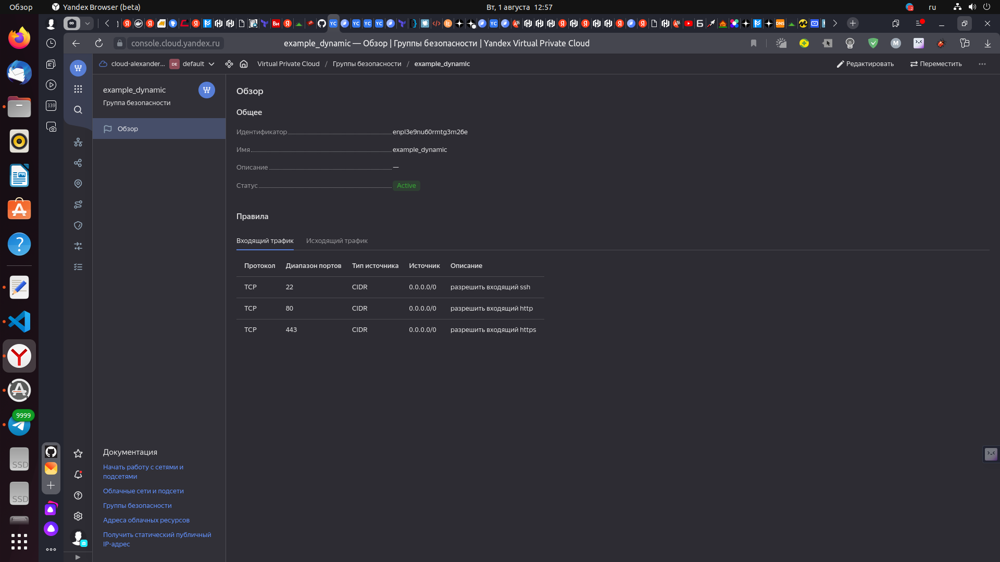
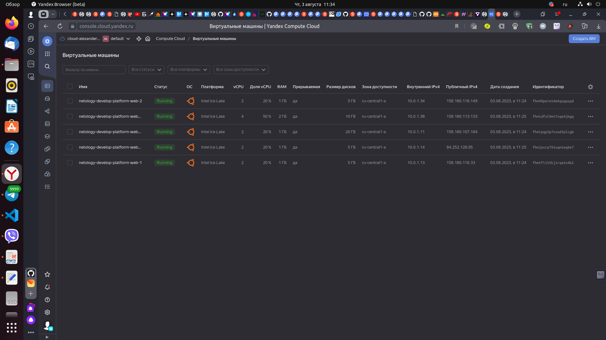
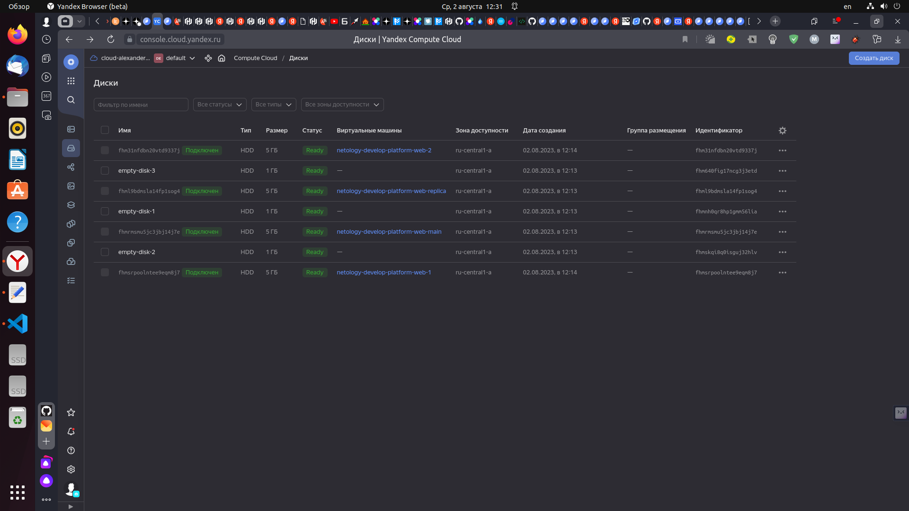
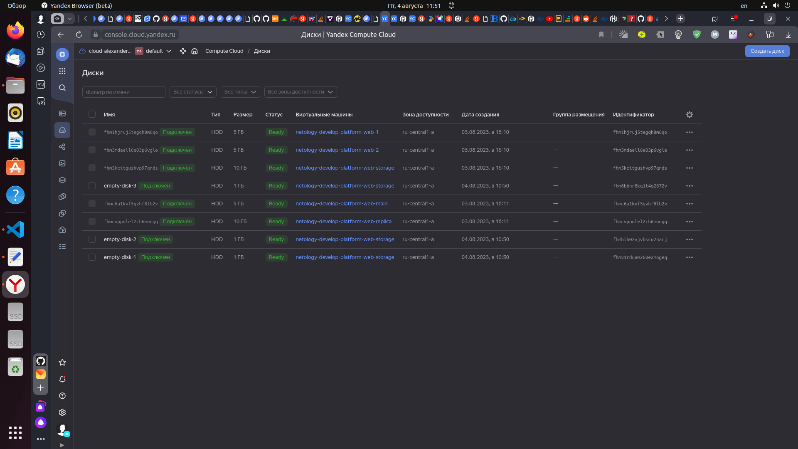
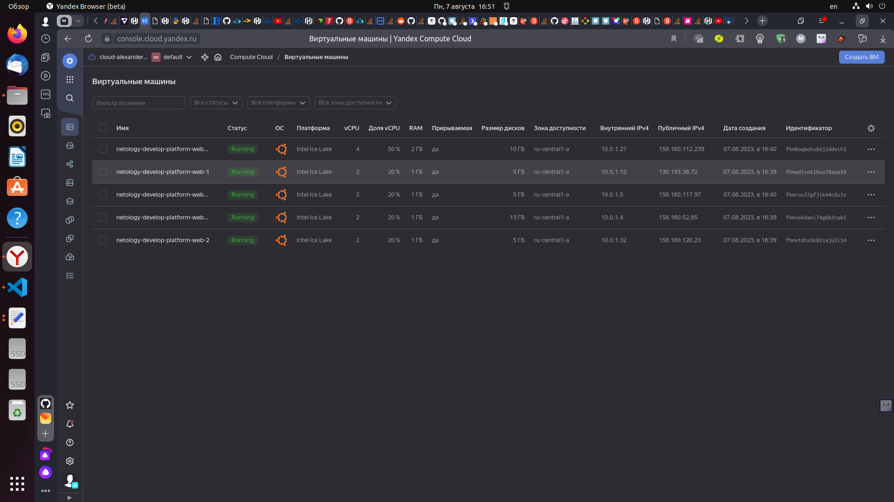
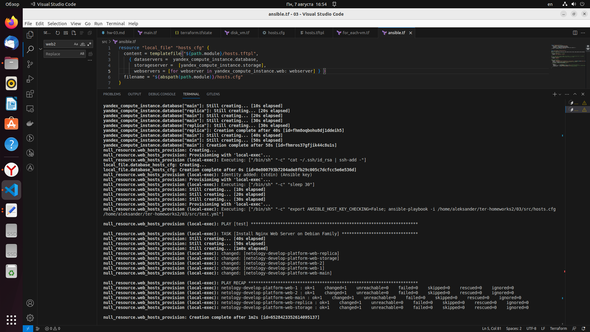
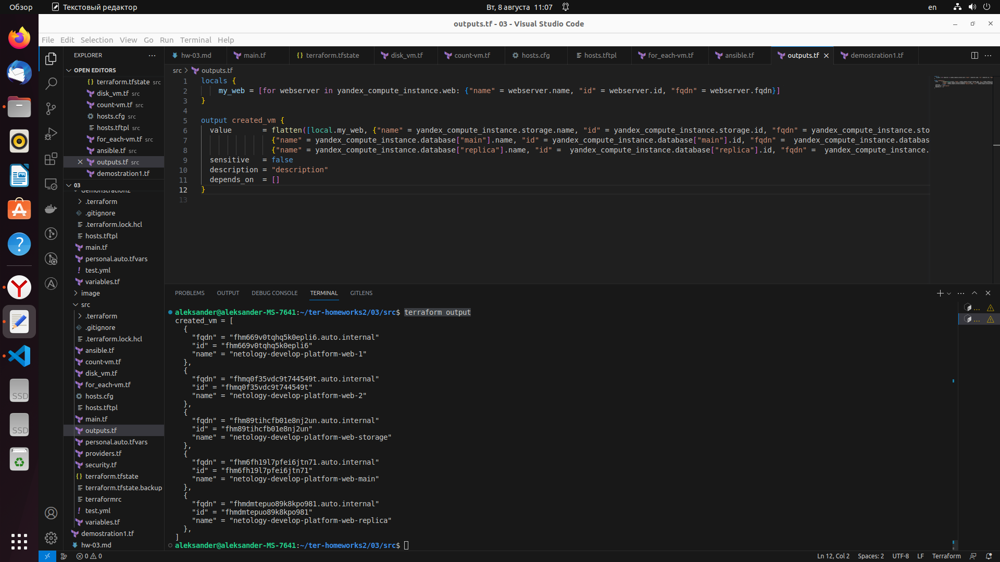
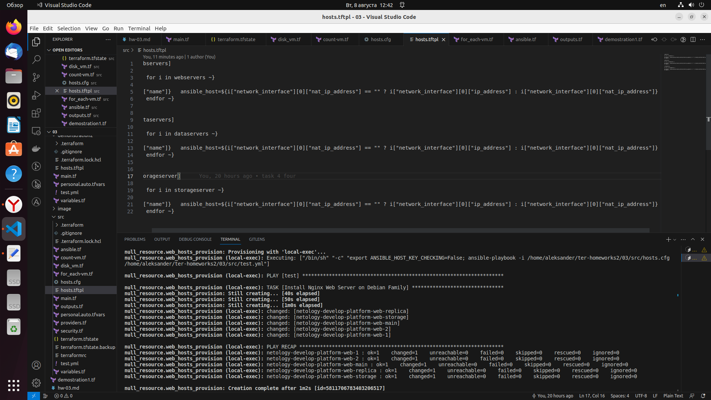
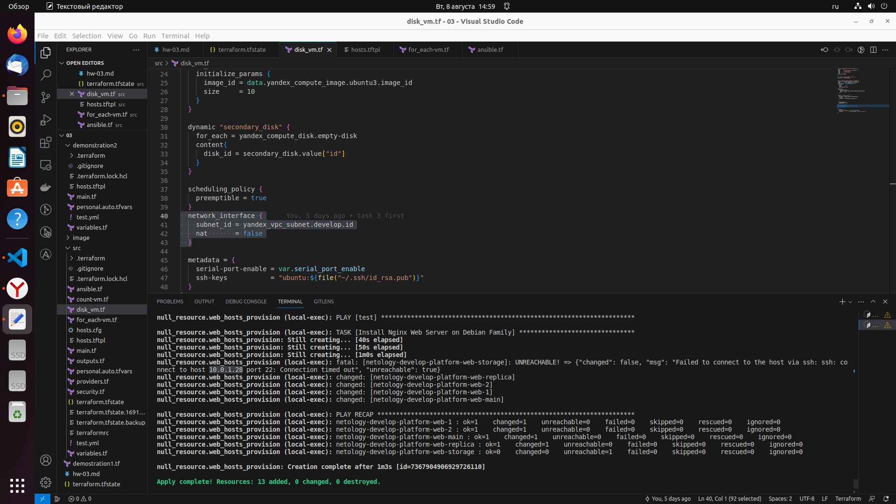

# Домашнее задание к занятию "Управляющие конструкции в коде Terraform"

### Цель задания

1. Отработать основные принципы и методы работы с управляющими конструкциями Terraform
2. Освоить работу с шаблонизатором Terraform(Interpolation Syntax)

------

### Чеклист готовности к домашнему заданию

1. Зарегистрирован аккаунт в Yandex Cloud. Использован промокод на грант.
2. Установлен инструмент yandex cli.
3. Доступен исходный код для выполнения задания в директории [**03/src**](https://github.com/netology-code/ter-homeworks/tree/main/03/src).
4. Любые ВМ, использованные при выполнении задания должны быть прерываемыми, для экономии средств.

------

### Инструменты/ дополнительные материалы, которые пригодятся для выполнения задания

1. [Консоль управления Yandex Cloud](https://console.cloud.yandex.ru/folders/<cloud_id>/vpc/security-groups).
2. [Группы безопасности](https://cloud.yandex.ru/docs/vpc/concepts/security-groups?from=int-console-help-center-or-nav).
3. [Datasource compute disk](https://terraform-eap.website.yandexcloud.net/docs/providers/yandex/d/datasource_compute_disk.html).


### Задание 1

1. Изучите проект.
2. Заполните файл personal.auto.tfvars
3. Инициализируйте проект, выполните код (он выполнится даже если доступа к preview нет).

Примечание: Если у вас не активирован preview доступ к функционалу "Группы безопасности" в Yandex Cloud - запросите доступ у поддержки облачного провайдера. Обычно его выдают в течении 24-х часов.

Приложите скриншот входящих правил "Группы безопасности" в ЛК Yandex Cloud  или скриншот отказа в предоставлении доступа к preview версии.

### Решение 1

 - Создаем файл personal.auto.tfvars и прописываем туда следующий код:
```
cloud_id = "<your cloud_id>"
folder_id = "<your folder_id>"
token = "<your token>"
```
 
 - Выполняем команды terraform init, terraform plan, затем terraform apply
 - Cкриншот входящих правил "Группы безопасности" в ЛК Yandex Cloud: 
 
<p align="center">
  
</p>  

------

### Задание 2

1. Создайте файл count-vm.tf. Опишите в нем создание двух **одинаковых** ВМ  web-1 и web-2(не web-0 и web-1!), с минимальными параметрами, используя мета-аргумент **count loop**. Назначьте ВМ созданную в 1-м задании группу безопасности.
2. Создайте файл for_each-vm.tf. Опишите в нем создание 2 ВМ с именами "main" и "replica" **разных** по cpu/ram/disk , используя мета-аргумент **for_each loop**. Используйте для обеих ВМ одну, общую переменную типа list(object({ vm_name=string, cpu=number, ram=number, disk=number  })). При желании внесите в переменную все возможные параметры.
3. ВМ из пункта 2.2 должны создаваться после создания ВМ из пункта 2.1.
4. Используйте функцию file в local переменной для считывания ключа ~/.ssh/id_rsa.pub и его последующего использования в блоке metadata, взятому из ДЗ №2.
5. Инициализируйте проект, выполните код.


### Решение 2

1. Создаем файл count-vm.tf и прописываем следующий код:

```
data "yandex_compute_image" "ubuntu" {
  family = var.vm_web_family
}
resource "yandex_compute_instance" "web" {
  count       = 2
  name        = "${var.name_vm}-${count.index + 1}"
  platform_id = var.vm_web_platform_id
  resources {
    cores         = 2
    memory        = 1
    core_fraction = 20
  }
  boot_disk {
    initialize_params {
      image_id = data.yandex_compute_image.ubuntu.image_id
    }
  }
  scheduling_policy {
    preemptible = true
  }
  network_interface {
    subnet_id = yandex_vpc_subnet.develop.id
    nat       = true
    security_group_ids = [yandex_vpc_security_group.example.id]
  }


  metadata = {
    serial-port-enable = var.serial_port_enable
    ssh-keys           = "ubuntu:${var.vms_ssh_root_key}"
  }

}
```

2. Создаем файл for_each-vm.tf, в файле variables.tf прописываем прописываем конфигурации создаваемых ВМ:
```
variable "vms_resources" {
  description = "resourses VMS cloud"
  default     = {
    vm_main_resources = {
      cores         = 2
      memory        = 1
      core_fraction = 20 
      size          = 5     
    }

    vm_replica_resources = {
      cores         = 4
      memory        = 2
      core_fraction = 50
      size          = 10 
    }
  }
}
```

 В файл for_each-vm.tf прописываем прописываем следующую конфигурацию: 
```
data "yandex_compute_image" "ubuntu2" {
  family = var.vm_web_family
}
resource "yandex_compute_instance" "database" {
  for_each = {
    "main" = [var.vms_resources["vm_main_resources"]["cores"], var.vms_resources["vm_main_resources"]["memory"], var.vms_resources["vm_main_resources"]["core_fraction"],
     var.vms_resources["vm_main_resources"]["size"]]
    "replica" = [var.vms_resources["vm_replica_resources"]["cores"], var.vms_resources["vm_replica_resources"]["memory"], var.vms_resources["vm_replica_resources"]["core_fraction"], 
     var.vms_resources["vm_replica_resources"]["size"]]
    }
  name        = "${var.name_vm}-${each.key}"
  platform_id = var.vm_web_platform_id
  resources {
    cores         = "${each.value[0]}"
    memory        = "${each.value[1]}"
    core_fraction = "${each.value[2]}"

  } 
  boot_disk {
    initialize_params {
      image_id = data.yandex_compute_image.ubuntu.image_id
      size     = "${each.value[3]}"
    }
  }
  scheduling_policy {
    preemptible = true
  }
  network_interface {
    subnet_id = yandex_vpc_subnet.develop.id
    nat       = true
  }

  metadata = {
    serial-port-enable = var.serial_port_enable
    ssh-keys           = "ubuntu:${var.vms_ssh_root_key}"
  }
}
```

3. В файл for_each-vm.tf в ресурс resource "yandex_compute_instance" "database" дописываем строку depends_on = [yandex_compute_instance.web, yandex_compute_instance.storage]

 Скорректировнный код будет выглядеть таким образом:
```
................
resource "yandex_compute_instance" "database" {
  depends_on = [yandex_compute_instance.web, yandex_compute_instance.storage]
  for_each = {
    "main" = [var.vms_resources["vm_main_resources"]["cores"], var.vms_resources["vm_main_resources"]["memory"], var.vms_resources["vm_main_resources"]["core_fraction"], 
    var.vms_resources["vm_main_resources"]["size"]]
    "replica" = [var.vms_resources["vm_replica_resources"]["cores"], var.vms_resources["vm_replica_resources"]["memory"], var.vms_resources["vm_replica_resources"]["core_fraction"],
    var.vms_resources["vm_replica_resources"]["size"]]
    }
...........

```

4. В блоке **metdata** каждой создаваемой ВМ прописываем следующий код:
```
  metadata = {
    serial-port-enable = var.serial_port_enable
    ssh-keys           = "ubuntu:${file("~/.ssh/id_rsa.pub")}"
  }
}
```

5. Выполняем terraform plan и terraform apply, смотрим созданные ресурсы в ЛК:

<p align="center">
  
</p>  


------

### Задание 3

1. Создайте 3 одинаковых виртуальных диска, размером 1 Гб с помощью ресурса yandex_compute_disk и мета-аргумента count в файле **disk_vm.tf** .
2. Создайте в том же файле одну ВМ c именем "storage" . Используйте блок **dynamic secondary_disk{..}** и мета-аргумент for_each для подключения созданных вами дополнительных дисков.

### Решение 3

1. Создаем файл **disk_vm.tf** и прописываем туда следующий код:
```
resource "yandex_compute_disk" "empty-disk" {
  count      = 3
  name       = "empty-disk-${count.index + 1}"
  type       = "network-hdd"
  zone       = "ru-central1-a"
  size       = 1
  block_size = 4096
}
```
  Проверяем в ЛК yandex cloud созданные диски:
  
<p align="center">
  
</p>  

2. Создаем одну ВМ c именем "storage", прописываем для нее следующий код:
```
data "yandex_compute_image" "ubuntu3" {
  family = var.vm_web_family
}

resource "yandex_compute_instance" "storage" {
  depends_on = [yandex_compute_disk.empty-disk]  
  name        = "${var.name_vm}-${"storage"}"
  platform_id = var.vm_web_platform_id
  resources {
    cores         = 2
    memory        = 1
    core_fraction = 20
  }
  boot_disk {
    initialize_params {
      image_id = data.yandex_compute_image.ubuntu3.image_id
      size     = 10
    }
  }

  dynamic "secondary_disk" {
    for_each = yandex_compute_disk.empty-disk
    content{
      disk_id = secondary_disk.value["id"]
    } 
  }
  
  scheduling_policy {
    preemptible = true
  }
  network_interface {
    subnet_id = yandex_vpc_subnet.develop.id
    nat       = true
  }

  metadata = {
    serial-port-enable = var.serial_port_enable
    ssh-keys           = "ubuntu:${file("~/.ssh/id_rsa.pub")}"
  }
}
```
  Выполняем команды terraform plan и terraform apply, смотрим созданные ресурсы в ЛК:
<p align="center">
  
</p>   
  
------

### Задание 4

1. В файле ansible.tf создайте inventory-файл для ansible.
Используйте функцию tepmplatefile и файл-шаблон для создания ansible inventory-файла из лекции.
Готовый код возьмите из демонстрации к лекции [**demonstration2**](https://github.com/netology-code/ter-homeworks/tree/main/demonstration2).
Передайте в него в качестве переменных группы виртуальных машин из задания 2.1, 2.2 и 3.2.(т.е. 5 ВМ)
2. Инвентарь должен содержать 3 группы [webservers], [databases], [storage] и быть динамическим, т.е. обработать как группу из 2-х ВМ так и 999 ВМ.
3. Выполните код. Приложите скриншот получившегося файла. 

Для общего зачета создайте в вашем GitHub репозитории новую ветку terraform-03. Закомитьте в эту ветку свой финальный код проекта, пришлите ссылку на коммит.   
**Удалите все созданные ресурсы**.

### Решение 4

1. Создаем файл ansible.tf, переносим в него файл-шаблон для создания ansible inventory-файла из лекции, редактируем блок с функцией tepmplatefile:

```
resource "local_file" "hosts_cfg" {
  content = templatefile("${path.module}/hosts.tftpl",
    { dataservers =  yandex_compute_instance.database,  
      storageserver =  [yandex_compute_instance.storage],
      webservers = yandex_compute_instance.web } )
  filename = "${abspath(path.module)}/hosts.cfg"
}
```

3.  Выполняем команды terraform plan и terraform apply, смотрим созданные ресурсы в ЛК:
<p align="center">
  
</p> 

Скриншот завершения работы terraform apply, прокси-сервер nginx установлен на все хосты: 
<p align="center">
  
</p> 

------

## Дополнительные задания (со звездочкой*)

**Настоятельно рекомендуем выполнять все задания под звёздочкой.**   Их выполнение поможет глубже разобраться в материале.   
Задания под звёздочкой дополнительные (необязательные к выполнению) и никак не повлияют на получение вами зачета по этому домашнему заданию. 

### Задание 5*(необязательное)
1. Напишите output, который отобразит все 5 созданных ВМ в виде списка словарей:
``` 
[
 {
  "name" = 'имя ВМ1'
  "id"   = 'идентификатор ВМ1'
  "fqdn" = 'Внутренний FQDN ВМ1'
 },
 {
  "name" = 'имя ВМ2'
  "id"   = 'идентификатор ВМ2'
  "fqdn" = 'Внутренний FQDN ВМ2'
 },
 ....
]
```
Приложите скриншот вывода команды ```terrafrom output```

### Решение 5*

1. Создаем файл outputs.tf, прописываем следующий код:
```
locals {
    my_web = [for webserver in yandex_compute_instance.web: {"name" = webserver.name, "id" = webserver.id, "fqdn" = webserver.fqdn}]
    my_database = [for databaseserver in yandex_compute_instance.web: {"name" = databaseserver.name, "id" = databaseserver.id, "fqdn" = databaseserver.fqdn}]
    my_storage = [{"name" = yandex_compute_instance.storage.name, "id" = yandex_compute_instance.storage.id, "fqdn" = yandex_compute_instance.storage.fqdn}]
}

output created_vm {
  value       = concat(local.my_web, local.my_database, local.my_storage)
  sensitive   = false
  description = "description"
  depends_on  = []
}

```

Запускаем команду terraform output, получаем следующий вывод:
<p align="center">
  
</p> 

------

### Задание 6*(необязательное)

1. Используя null_resource и local-exec примените ansible-playbook к ВМ из ansible inventory файла.
Готовый код возьмите из демонстрации к лекции [**demonstration2**](https://github.com/netology-code/ter-homeworks/tree/main/demonstration2).
2. Дополните файл шаблон hosts.tftpl. 
Формат готового файла:
```
netology-develop-platform-web-0   ansible_host="<внешний IP-address или внутренний IP-address если у ВМ отсутвует внешний адрес>"
```
Для проверки работы уберите у ВМ внешние адреса. Этот вариант используется при работе через bastion сервер.
Для зачета предоставьте код вместе с основной частью задания.


### Решение 6*

2. Дополняем код hosts.tftpl условным выпажением для проверки наличия внешнего IP-addressa, в результате получается такой код в hosts.tftpl:
```
webservers]

%{~ for i in webservers ~}

${i["name"]}   ansible_host=${i["network_interface"][0]["nat_ip_address"] == "" ? i["network_interface"][0]["ip_address"] : i["network_interface"][0]["nat_ip_address"]}
%{~ endfor ~}


[dataservers]

%{~ for i in dataservers ~}

${i["name"]}   ansible_host=${i["network_interface"][0]["nat_ip_address"] == "" ? i["network_interface"][0]["ip_address"] : i["network_interface"][0]["nat_ip_address"]} 
%{~ endfor ~}


[storageserver]

%{~ for i in storageserver ~}

${i["name"]}   ansible_host=${i["network_interface"][0]["nat_ip_address"] == "" ? i["network_interface"][0]["ip_address"] : i["network_interface"][0]["nat_ip_address"]} 
%{~ endfor ~}
```
Выполняем команды terraform plan и terraform apply, получаем следующий вывод, сервер nginx установлен:
<p align="center">
  
</p> 

Проверяем работу написанного кода, у ресурса "yandex_compute_instance" "storage" отключаем nat:
```
  network_interface {
    subnet_id = yandex_vpc_subnet.develop.id
    nat       = false
  }
```

Выполняем команды terraform destroy и terraform apply, получаем следующий вывод, ansible хочет подключиться к "yandex_compute_instance" "storage" через локальный адрес 10.0.1.28:
<p align="center">
  
</p> 


### Правила приема работы

В своём git-репозитории создайте новую ветку terraform-03, закомитьте в эту ветку свой финальный код проекта. Ответы на задания и необходимые скриншоты оформите в md-файле в ветке terraform-03.

В качестве результата прикрепите ссылку на ветку terraform-03 в вашем репозитории.

ВАЖНО!Удалите все созданные ресурсы.

### Критерии оценки

Зачёт:

* выполнены все задания;
* ответы даны в развёрнутой форме;
* приложены соответствующие скриншоты и файлы проекта;
* в выполненных заданиях нет противоречий и нарушения логики.

На доработку:

* задание выполнено частично или не выполнено вообще;
* в логике выполнения заданий есть противоречия и существенные недостатки. 

