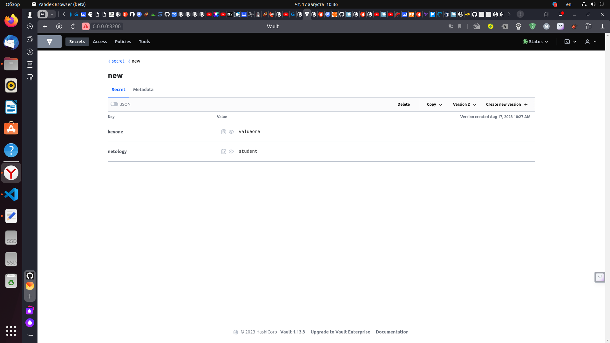

# Домашнее задание к занятию "Продвинутые методы работы с Terraform"

### Цель задания

1. Научиться использовать модули.
2. Отработать операции state.
3. Закрепить пройденный материал.


### Чеклист готовности к домашнему заданию

1. Зарегистрирован аккаунт в Yandex Cloud. Использован промокод на грант.
2. Установлен инструмент yandex CLI
3. Исходный код для выполнения задания расположен в директории [**04/src**](https://github.com/netology-code/ter-homeworks/tree/main/04/src).
4. Любые ВМ, использованные при выполнении задания должны быть прерываемыми, для экономии средств.

------

### Задание 1

1. Возьмите из [демонстрации к лекции готовый код](https://github.com/netology-code/ter-homeworks/tree/main/04/demonstration1) для создания ВМ с помощью remote модуля.
2. Создайте 1 ВМ, используя данный модуль. В файле cloud-init.yml необходимо использовать переменную для ssh ключа вместо хардкода. Передайте ssh-ключ в функцию template_file в блоке vars ={} .
Воспользуйтесь [**примером**](https://grantorchard.com/dynamic-cloudinit-content-with-terraform-file-templates/). Обратите внимание что ssh-authorized-keys принимает в себя список, а не строку!
3. Добавьте в файл cloud-init.yml установку nginx.
4. Предоставьте скриншот подключения к консоли и вывод команды ```sudo nginx -t```.


### Решение 1

2. В файле main.tf редактируем код модуля для создания 1 ВМ, прописывам следующий код:
```
module "test-vm" {
  source          = "git::https://github.com/udjin10/yandex_compute_instance.git?ref=main"
  env_name        = "develop"
  network_id      = yandex_vpc_network.develop.id
  subnet_zones    = ["ru-central1-a"]
  subnet_ids      = [ yandex_vpc_subnet.develop.id ]
  instance_name   = "web"
  instance_count  = 1
  image_family    = "ubuntu-2004-lts"
  public_ip       = true
```

В этом файле прописываем блок функции template_file для передачи ssh-ключа в файл cloud-init.yml:
```
data "template_file" "cloudinit" {
 template = file("./cloud-init.yml")
 vars = {
  vms_ssh_root_key = var.vms_ssh_root_key
 }
}
```
В файле cloud-init.yml используем переменную для ssh ключа вместо хардкода:
```
---
users:
  - name: ubuntu
    groups: sudo
    shell: /bin/bash
    sudo: ["ALL=(ALL) NOPASSWD:ALL"]
    ssh_authorized_keys:
      - ${vms_ssh_root_key}
package_update: true
package_upgrade: false
packages:
  - vim
```

3. В файле cloud-init.yml прописывам установку nginx:
```
#cloud-config
users:
  - name: ubuntu
    groups: sudo
    shell: /bin/bash
    sudo: ["ALL=(ALL) NOPASSWD:ALL"]
    ssh_authorized_keys:
      - ${vms_ssh_root_key}
package_update: true
package_upgrade: false
packages:
  - vim
  - nginx
runcmd:
  - sudo apt update
  - sudo apt install -y nginx
```
4. Подключаемся к созданной ВМ через консоль и запускаем команду ```sudo nginx -t```, получаем следующий вывод:
<p align="center">
  
</p> 

------

### Задание 2

1. Напишите локальный модуль vpc, который будет создавать 2 ресурса: **одну** сеть и **одну** подсеть в зоне, объявленной при вызове модуля. например: ```ru-central1-a```.
2. Вы должны передать в модуль переменные с названием сети, zone и v4_cidr_blocks.
3. Модуль должен возвращать в root module с помощью output информацию о yandex_vpc_subnet. Пришлите скриншот информации из terraform console о своем модуле. Пример: > module.vpc_dev
4. Замените ресурсы yandex_vpc_network и yandex_vpc_subnet созданным модулем. Не забудьте передать необходимые параметры сети из модуля vpc в модуль с виртуальной машиной.
5. Откройте terraform console и предоставьте скриншот содержимого модуля. Пример: > module.vpc_dev.
6. Сгенерируйте документацию к модулю с помощью terraform-docs.   
 
Пример вызова:
```
module "vpc_dev" {
  source       = "./vpc"
  env_name     = "develop"
  zone = "ru-central1-a"
  cidr = "10.0.1.0/24"
}
```
### Решение 2

1. Создаем отдельную папку vpc  в которой будет храниться создаваемый модуль и создаем три файла main.tf, variables.tf, outputs.tf, прописываем в main.tf:
```
terraform {
  required_providers {
    yandex = {
      source = "yandex-cloud/yandex"
    }
  }
}

resource "yandex_vpc_network" "vpc" {
  name = var.vpc_name
}

resource "yandex_vpc_subnet" "subnet_vpc" {
  name           = var.vpc_name
  zone           = var.default_zone
  network_id     = yandex_vpc_network.vpc.id
  v4_cidr_blocks = var.default_cidr
}
```

2. В файле variables.tf прописываем:
```
variable "vpc_name" {
  type        = string
  default     = "develop"
  description = "VPC network&subnet name"
}

variable "default_zone" {
  type        = string
  default     = "ru-central1-a"
  description = "https://cloud.yandex.ru/docs/overview/concepts/geo-scope"
}

variable "default_cidr" {
  type        = list(string)
  default     = ["10.0.1.0/24"]
  description = "https://cloud.yandex.ru/docs/vpc/operations/subnet-create"
}
```

3. В файле outputs.tf прописываем:

```
output "vpc_id" {
  value       = yandex_vpc_network.vpc.id
  sensitive   = false
  description = "description"
  depends_on  = []
}

output "subnet_vpc_id" {
  value       = yandex_vpc_subnet.subnet_vpc.id
  sensitive   = false
  description = "description"
  depends_on  = []
}
```
 

4. Заменяем ресурсы yandex_vpc_network и yandex_vpc_subnet созданным модулем. 
```
module "test-vm" {
  source          = "git::https://github.com/udjin10/yandex_compute_instance.git?ref=main"
  env_name        = "develop"
  network_id      = module.vpc.vpc_id
  subnet_zones    = ["ru-central1-a"]
  subnet_ids      = [module.vpc.subnet_vpc_id]
  instance_name   = "web"
  instance_count  = 1
  image_family    = "ubuntu-2004-lts"
  public_ip       = true
  
  metadata = {
      user-data          = data.template_file.cloudinit.rendered #Для демонстрации №3
      serial-port-enable = 1
  }
}

```

5. Открываем terraform console и смтрим содержимое модуля.
<p align="center">
  
</p> 

6. Генерируем документацию к модулю с помощью terraform-docs.
## Requirements

| Name | Version |
|------|---------|
| <a name="requirement_terraform"></a> [terraform](#requirement\_terraform) | >=0.13 |

## Providers

| Name | Version |
|------|---------|
| <a name="provider_template"></a> [template](#provider\_template) | 2.2.0 |

## Modules

| Name | Source | Version |
|------|--------|---------|
| <a name="module_test-vm"></a> [test-vm](#module\_test-vm) | git::https://github.com/udjin10/yandex_compute_instance.git | main |
| <a name="module_vpc"></a> [vpc](#module\_vpc) | ./vpc | n/a |

## Resources

| Name | Type |
|------|------|
| [template_file.cloudinit](https://registry.terraform.io/providers/hashicorp/template/latest/docs/data-sources/file) | data source |

## Inputs

| Name | Description | Type | Default | Required |
|------|-------------|------|---------|:--------:|
| <a name="input_cloud_id"></a> [cloud\_id](#input\_cloud\_id) | https://cloud.yandex.ru/docs/resource-manager/operations/cloud/get-id | `string` | n/a | yes |
| <a name="input_default_zone"></a> [default\_zone](#input\_default\_zone) | https://cloud.yandex.ru/docs/overview/concepts/geo-scope | `string` | `"ru-central1-a"` | no |
| <a name="input_folder_id"></a> [folder\_id](#input\_folder\_id) | https://cloud.yandex.ru/docs/resource-manager/operations/folder/get-id | `string` | n/a | yes |
| <a name="input_token"></a> [token](#input\_token) | OAuth-token; https://cloud.yandex.ru/docs/iam/concepts/authorization/oauth-token | `string` | n/a | yes |
| <a name="input_vm_db_name"></a> [vm\_db\_name](#input\_vm\_db\_name) | example vm\_db\_ prefix | `string` | `"netology-develop-platform-db"` | no |
| <a name="input_vm_web_name"></a> [vm\_web\_name](#input\_vm\_web\_name) | example vm\_web\_ prefix | `string` | `"netology-develop-platform-web"` | no |
| <a name="input_vms_ssh_root_key"></a> [vms\_ssh\_root\_key](#input\_vms\_ssh\_root\_key) | ssh-keygen -t ed25519 | `string` | `"ssh-rsa <your key>"` | no |

## Outputs

No outputs.

### Задание 3
1. Выведите список ресурсов в стейте.
2. Полностью удалите из стейта модуль vpc.
3. Полностью удалите из стейта модуль vm.
4. Импортируйте все обратно. Проверьте terraform plan - изменений быть не должно.
Приложите список выполненных команд и скриншоты процессы.

### Решение 3

1. Набираем команду terraform state list, получаем список ресурсов в стейте:
```
aleksander@aleksander-MS-7641:~/ter-homeworks2/04/src$ terraform state list
data.template_file.cloudinit
module.test-vm.data.yandex_compute_image.my_image
module.test-vm.yandex_compute_instance.vm[0]
module.vpc.yandex_vpc_network.vpc
module.vpc.yandex_vpc_subnet.subnet_vpc
```

2. Перед удалением модулей записываем их id:
```
aleksander@aleksander-MS-7641:~/ter-homeworks2/04/src$ terraform state show 'module.test-vm.data.yandex_compute_image.my_image' | grep 'id'
    folder_id     = "standard-images"
    id            = "fd8mkq33tt9kvi2c10e5"
    image_id      = "fd8mkq33tt9kvi2c10e5"
    product_ids   = [
        "f2ei650idv4fdcutavos",
aleksander@aleksander-MS-7641:~/ter-homeworks2/04/src$ terraform state show 'module.test-vm.yandex_compute_instance.vm[0]' | grep 'id'
    folder_id                 = "b1g7kr9i41eoi2fqj52o"
    id                        = "fhmfn4fhjph963n4hklp"
                  - ssh-rsa <your key>
    platform_id               = "standard-v1"
        disk_id     = "fhmjij6ocrjjk9aen5kg"
            image_id   = "fd8mkq33tt9kvi2c10e5"
        security_group_ids = []
        subnet_id          = "e9b41qi3ns1tvsvdt4kb"
aleksander@aleksander-MS-7641:~/ter-homeworks2/04/src$ terraform state show 'module.vpc.yandex_vpc_network.vpc' | grep 'id'
    folder_id  = "b1g7kr9i41eoi2fqj52o"
    id         = "enp5ar0mh1g6qeojblel"
    subnet_ids = []
aleksander@aleksander-MS-7641:~/ter-homeworks2/04/src$ terraform state show 'module.vpc.yandex_vpc_subnet.subnet_vpc' | grep 'id'
    folder_id      = "b1g7kr9i41eoi2fqj52o"
    id             = "e9b41qi3ns1tvsvdt4kb"
    network_id     = "enp5ar0mh1g6qeojblel"
    v4_cidr_blocks = [
    v6_cidr_blocks = []
```

Полностью удаляем модули vpc и vm, и выводим команду terraform state list:
```
aleksander@aleksander-MS-7641:~/ter-homeworks2/04/src$ terraform state rm 'module.test-vm.data.yandex_compute_image.my_image'
Removed module.test-vm.data.yandex_compute_image.my_image
Successfully removed 1 resource instance(s).
aleksander@aleksander-MS-7641:~/ter-homeworks2/04/src$ terraform state rm 'module.test-vm.yandex_compute_instance.vm[0]'
Removed module.test-vm.yandex_compute_instance.vm[0]
Successfully removed 1 resource instance(s).
aleksander@aleksander-MS-7641:~/ter-homeworks2/04/src$ terraform state rm 'module.vpc.yandex_vpc_network.vpc'
Removed module.vpc.yandex_vpc_network.vpc
Successfully removed 1 resource instance(s).
aleksander@aleksander-MS-7641:~/ter-homeworks2/04/src$ terraform state rm 'module.vpc.yandex_vpc_subnet.subnet_vpc'
Removed module.vpc.yandex_vpc_subnet.subnet_vpc
Successfully removed 1 resource instance(s).
aleksander@aleksander-MS-7641:~/ter-homeworks2/04/src$ terraform state list
data.template_file.cloudinit
aleksander@aleksander-MS-7641:~/ter-homeworks2/04/src$ 
```

4. Импортируем модули обратно в state и выводим команду terraform state list:
```
aleksander@aleksander-MS-7641:~/ter-homeworks2/04/src$ terraform import 'module.test-vm.yandex_compute_instance.vm[0]' fhmfn4fhjph963n4hklp
╷
│ Warning: Version constraints inside provider configuration blocks are deprecated
│ 
│   on .terraform/modules/test-vm/providers.tf line 2, in provider "template":
│    2:   version = "2.2.0"
│ 
│ Terraform 0.13 and earlier allowed provider version constraints inside the provider configuration block, but that is now deprecated and will be removed in a future version of Terraform. To
│ silence this warning, move the provider version constraint into the required_providers block.
╵

module.test-vm.data.yandex_compute_image.my_image: Reading...
data.template_file.cloudinit: Reading...
data.template_file.cloudinit: Read complete after 0s [id=e6092c9b7cfc4c0bdb01e6d2a10150dadf361678ccac6ec16188c2074bdda7a4]
module.test-vm.data.yandex_compute_image.my_image: Read complete after 1s [id=fd8mkq33tt9kvi2c10e5]
module.test-vm.yandex_compute_instance.vm[0]: Importing from ID "fhmfn4fhjph963n4hklp"...
module.test-vm.yandex_compute_instance.vm[0]: Import prepared!
  Prepared yandex_compute_instance for import
module.test-vm.yandex_compute_instance.vm[0]: Refreshing state... [id=fhmfn4fhjph963n4hklp]

Import successful!

The resources that were imported are shown above. These resources are now in
your Terraform state and will henceforth be managed by Terraform.

╷
│ Warning: Version constraints inside provider configuration blocks are deprecated
│ 
│   on .terraform/modules/test-vm/providers.tf line 2, in provider "template":
│    2:   version = "2.2.0"
│ 
│ Terraform 0.13 and earlier allowed provider version constraints inside the provider configuration block, but that is now deprecated and will be removed in a future version of Terraform. To
│ silence this warning, move the provider version constraint into the required_providers block.
│ 
│ (and one more similar warning elsewhere)
╵

aleksander@aleksander-MS-7641:~/ter-homeworks2/04/src$ terraform import 'module.vpc.yandex_vpc_network.vpc' enp5ar0mh1g6qeojblel
╷
│ Warning: Version constraints inside provider configuration blocks are deprecated
│ 
│   on .terraform/modules/test-vm/providers.tf line 2, in provider "template":
│    2:   version = "2.2.0"
│ 
│ Terraform 0.13 and earlier allowed provider version constraints inside the provider configuration block, but that is now deprecated and will be removed in a future version of Terraform. To
│ silence this warning, move the provider version constraint into the required_providers block.
╵

data.template_file.cloudinit: Reading...
data.template_file.cloudinit: Read complete after 0s [id=e6092c9b7cfc4c0bdb01e6d2a10150dadf361678ccac6ec16188c2074bdda7a4]
module.vpc.yandex_vpc_network.vpc: Importing from ID "enp5ar0mh1g6qeojblel"...
module.test-vm.data.yandex_compute_image.my_image: Reading...
module.vpc.yandex_vpc_network.vpc: Import prepared!
  Prepared yandex_vpc_network for import
module.vpc.yandex_vpc_network.vpc: Refreshing state... [id=enp5ar0mh1g6qeojblel]
module.test-vm.data.yandex_compute_image.my_image: Read complete after 0s [id=fd8mkq33tt9kvi2c10e5]

Import successful!

The resources that were imported are shown above. These resources are now in
your Terraform state and will henceforth be managed by Terraform.

╷
│ Warning: Version constraints inside provider configuration blocks are deprecated
│ 
│   on .terraform/modules/test-vm/providers.tf line 2, in provider "template":
│    2:   version = "2.2.0"
│ 
│ Terraform 0.13 and earlier allowed provider version constraints inside the provider configuration block, but that is now deprecated and will be removed in a future version of Terraform. To
│ silence this warning, move the provider version constraint into the required_providers block.
│ 
│ (and one more similar warning elsewhere)
╵

aleksander@aleksander-MS-7641:~/ter-homeworks2/04/src$ terraform import 'module.vpc.yandex_vpc_subnet.subnet_vpc' e9b41qi3ns1tvsvdt4kb
╷
│ Warning: Version constraints inside provider configuration blocks are deprecated
│ 
│   on .terraform/modules/test-vm/providers.tf line 2, in provider "template":
│    2:   version = "2.2.0"
│ 
│ Terraform 0.13 and earlier allowed provider version constraints inside the provider configuration block, but that is now deprecated and will be removed in a future version of Terraform. To
│ silence this warning, move the provider version constraint into the required_providers block.
╵

data.template_file.cloudinit: Reading...
data.template_file.cloudinit: Read complete after 0s [id=e6092c9b7cfc4c0bdb01e6d2a10150dadf361678ccac6ec16188c2074bdda7a4]
module.test-vm.data.yandex_compute_image.my_image: Reading...
module.vpc.yandex_vpc_subnet.subnet_vpc: Importing from ID "e9b41qi3ns1tvsvdt4kb"...
module.vpc.yandex_vpc_subnet.subnet_vpc: Import prepared!
  Prepared yandex_vpc_subnet for import
module.vpc.yandex_vpc_subnet.subnet_vpc: Refreshing state... [id=e9b41qi3ns1tvsvdt4kb]
module.test-vm.data.yandex_compute_image.my_image: Read complete after 1s [id=fd8mkq33tt9kvi2c10e5]

Import successful!

The resources that were imported are shown above. These resources are now in
your Terraform state and will henceforth be managed by Terraform.

╷
│ Warning: Version constraints inside provider configuration blocks are deprecated
│ 
│   on .terraform/modules/test-vm/providers.tf line 2, in provider "template":
│    2:   version = "2.2.0"
│ 
│ Terraform 0.13 and earlier allowed provider version constraints inside the provider configuration block, but that is now deprecated and will be removed in a future version of Terraform. To
│ silence this warning, move the provider version constraint into the required_providers block.
│ 
│ (and one more similar warning elsewhere)
╵

aleksander@aleksander-MS-7641:~/ter-homeworks2/04/src$ terraform state list
data.template_file.cloudinit
module.test-vm.data.yandex_compute_image.my_image
module.test-vm.yandex_compute_instance.vm[0]
module.vpc.yandex_vpc_network.vpc
module.vpc.yandex_vpc_subnet.subnet_vpc
```

Проверяем изменения terraform plan:
<p align="center">
  
</p> 


## Дополнительные задания (со звездочкой*)

**Настоятельно рекомендуем выполнять все задания под звёздочкой.**   Их выполнение поможет глубже разобраться в материале.   
Задания под звёздочкой дополнительные (необязательные к выполнению) и никак не повлияют на получение вами зачета по этому домашнему заданию. 


### Задание 4*

1. Измените модуль vpc так, чтобы он мог создать подсети во всех зонах доступности, переданных в переменной типа list(object) при вызове модуля.  
  
Пример вызова:
```
module "vpc_prod" {
  source       = "./vpc"
  env_name     = "production"
  subnets = [
    { zone = "ru-central1-a", cidr = "10.0.1.0/24" },
    { zone = "ru-central1-b", cidr = "10.0.2.0/24" },
    { zone = "ru-central1-c", cidr = "10.0.3.0/24" },
  ]
}

module "vpc_dev" {
  source       = "./vpc"
  env_name     = "develop"
  subnets = [
    { zone = "ru-central1-a", cidr = "10.0.1.0/24" },
  ]
}
```

Предоставьте код, план выполнения, результат из консоли YC.

### Решение 4

1. Редактируем ранее созданный (в задании №3) модуль vpc:
 - в файл variables.tf дописываем переменную variable "subnets", дополненный код файла variables.tf будет таким:
 ```
 # vpc variables
variable "vpc_name" {
  type        = string
  default     = "develop"
  description = "VPC network&subnet name"
}

variable "default_zone" {
  type        = string
  default     = "ru-central1-a"
  description = "https://cloud.yandex.ru/docs/overview/concepts/geo-scope"
}

variable "default_cidr" {
  type        = list(string)
  default     = ["10.0.1.0/24"]
  description = "https://cloud.yandex.ru/docs/vpc/operations/subnet-create"
}

variable "subnets" {
  type        = list(object(
    {
       zone = string
       cidr = string 
    }
      ))
  default     = [
    { zone = "ru-central1-a", cidr = "10.0.1.0/24" },
    { zone = "ru-central1-b", cidr = "10.0.2.0/24" },
    { zone = "ru-central1-c", cidr = "10.0.3.0/24" },
  ]
  description = "https://cloud.yandex.ru/docs/vpc/operations/subnet-create"
}
 ```
 - в файле main.tf редактируем код ресурса создания подсети (resource "yandex_vpc_subnet" "subnet_vpc"), добавляем метааргумент for_each, код файла main.tf будет таким:
 ```
terraform {
  required_providers {
    yandex = {
      source = "yandex-cloud/yandex"
    }
  }
}

#создаем облачную сеть
resource "yandex_vpc_network" "vpc" {
  name = var.vpc_name
}

#создаем подсеть
resource "yandex_vpc_subnet" "subnet_vpc" {
  for_each = {for subnet in var.subnets: "${subnet.zone}.${subnet.cidr}" => subnet}
  name     = each.value.zone
  zone     = each.value.zone
  network_id     = yandex_vpc_network.vpc.id
  v4_cidr_blocks = [each.value.cidr]
}
 ```

 - в файле outputs.tf  редактируем output "subnet_vpc_id", создаем цикл, код файла outputs.tf будет таким:
 
 ```
 output "vpc_id" {
  value       = yandex_vpc_network.vpc.id
  sensitive   = false
  description = "description"
  depends_on  = []
}

output "subnet_vpc_id" {
  value       = [for subnet in yandex_vpc_subnet.subnet_vpc: subnet.id]
  sensitive   = false
  description = "description"
  depends_on  = []
}
 ```

2. 
 - Добавляем в основной файл variables.tf (не для модуля) переменную variable "subnets_list"
```
variable "subnets_list" {
  type        = list(object(
    {
       zone = string
       cidr = string 
    }
      ))
  default     = [
    { zone = "ru-central1-a", cidr = "10.0.1.0/24" },
    { zone = "ru-central1-b", cidr = "10.0.2.0/24" },
    { zone = "ru-central1-c", cidr = "10.0.3.0/24" },
  ]
  description = "https://cloud.yandex.ru/docs/vpc/operations/subnet-create"
}
```

 - Редактируем код основного файла main.tf (не для модуля), (отредактировали subnets = var.subnets_list и subnet_zones    = [for subnet in var.subnets_list: subnet.zone]) код файла main.tf будет таким:
 ```
 #создаем облачную сеть
module "vpc" {
  source        = "./vpc"
  vpc_name = var.vpc_name
  subnets = var.subnets_list
}

module "test-vm" {
  source          = "git::https://github.com/udjin10/yandex_compute_instance.git?ref=main"
  env_name        = var.env_name
  network_id      = module.vpc.vpc_id
  subnet_zones    = [for subnet in var.subnets_list: subnet.zone]
  subnet_ids      = module.vpc.subnet_vpc_id
  instance_name   = var.instance_name
  instance_count  = var.instance_count
  image_family    = var.image_family
  public_ip       = true
  
  metadata = {
      user-data          = data.template_file.cloudinit.rendered #Для демонстрации №3
      serial-port-enable = 1
  }
}

#Пример передачи cloud-config в ВМ для демонстрации №3
data "template_file" "cloudinit" {
 template = file("./cloud-init.yml")
 vars = {
    vms_ssh_root_key = var.vms_ssh_root_key
 }
}
 ```

3. Вводим команду terraform apply, смотрим созданные ресурсы:
<p align="center">
  
</p>

<p align="center">
  
</p>

<p align="center">
  
</p> 

<p align="center">
  
</p>   
  

### Задание 5***

1. Напишите модуль для создания кластера managed БД Mysql в Yandex Cloud с 1 или 3 хостами в зависимости от переменной HA=true или HA=false. Используйте ресурс yandex_mdb_mysql_cluster (передайте имя кластера и id сети).
2. Напишите модуль для создания базы данных и пользователя в уже существующем кластере managed БД Mysql. Используйте ресурсы yandex_mdb_mysql_database и yandex_mdb_mysql_user (передайте имя базы данных, имя пользователя и id кластера при вызове модуля).
3. Используя оба модуля, создайте кластер example из одного хоста, а затем добавьте в него БД test и пользователя app. Затем измените переменную и превратите сингл хост в кластер из 2х серверов.
4. 
Предоставьте план выполнения и по-возможности результат. Сразу же удаляйте созданные ресурсы, так как кластер может стоить очень дорого! Используйте минимальную конфигурацию.

### Задание 6*

1. Разверните у себя локально vault, используя docker-compose.yml в проекте.
2. Для входа в web интерфейс и авторизации terraform в vault используйте токен "education"
3. Создайте новый секрет по пути http://127.0.0.1:8200/ui/vault/secrets/secret/create  
Path: example  
secret data key: test 
secret data value: congrats!  
4. Считайте данный секрет с помощью terraform и выведите его в output по примеру:
```
provider "vault" {
 address = "http://<IP_ADDRESS>:<PORT_NUMBER>"
 skip_tls_verify = true
 token = "education"
}
data "vault_generic_secret" "vault_example"{
 path = "secret/example"
}

output "vault_example" {
 value = "${nonsensitive(data.vault_generic_secret.vault_example.data)}"
} 

можно обратится не к словарю, а конкретному ключу.
terraform console: >nonsensitive(data.vault_generic_secret.vault_example.data.<имя ключа в секрете>)
```
5. Попробуйте самостоятельно разобраться в документации и записать новый секрет в vault с помощью terraform. 


### Решение 6

1. Запускаем файл docker-compose.yml с помощью команды docker-compose up, предварительно откорректировав image: vault:1.13.3
2. Заходим в web интерфейс и авторизации terraform в vault используя токен "education"
3. Создаем новый секрет по пути http://127.0.0.1:8200/ui/vault/secrets/secret/create и нажимаем save, создался новый секрет: 
<p align="center">
  
</p>
4. Выполняем terraform apply, затем terraform output:
<p align="center">
  
</p>  

- вывод команды terraform output:
```
aleksander@aleksander-MS-7641:~/ter-homeworks2/04/demonstration3$ terraform output
vault_example = tomap({
  "test" = "congrats!"
})
```
5. Для записи нового секрета в vault с помощью terraform в файл main.tf добавляем новый ресурс в котором прописываем путь (path) и данные (ключи и значения):
```
resource "vault_generic_secret" "create_secret" {
  path = "secret/new"

  data_json = <<EOT
{
  "keyone":   "valueone",
  "netology": "student"
}
EOT
}

output "create_secret" {
 value = nonsensitive(vault_generic_secret.create_secret.data)
 sensitive = false

} 
```

Вводим команду terraform apply, смотрим результат в браузере:
<p align="center">
  
</p> 
<p align="center">
  
</p> 

### Правила приема работы

В своём git-репозитории создайте новую ветку terraform-04, закомитьте в эту ветку свой финальный код проекта. Ответы на задания и необходимые скриншоты оформите в md-файле в ветке terraform-04.

В качестве результата прикрепите ссылку на ветку terraform-04 в вашем репозитории.

**ВАЖНО!** Удалите все созданные ресурсы.

### Критерии оценки

Зачёт:

* выполнены все задания;
* ответы даны в развёрнутой форме;
* приложены соответствующие скриншоты и файлы проекта;
* в выполненных заданиях нет противоречий и нарушения логики.

На доработку:

* задание выполнено частично или не выполнено вообще;
* в логике выполнения заданий есть противоречия и существенные недостатки. 


