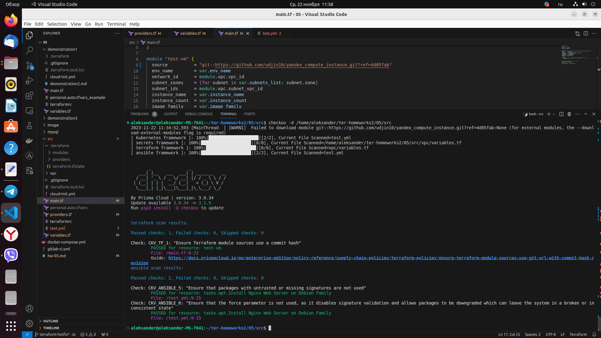

# Домашнее задание к занятию "Использование Terraform в команде"

### Цель задания

1. Научиться использовать remote state.
2. Освоить приемы командной работы.


### Чеклист готовности к домашнему заданию

1. Зарегистрирован аккаунт в Yandex Cloud. Использован промокод на грант.
2. Установлен инструмент Yandex CLI
3. Любые ВМ, использованные при выполнении задания должны быть прерываемыми, для экономии средств.

------

### Задание 1

1. Возьмите код:
- из [ДЗ к лекции №04](https://github.com/netology-code/ter-homeworks/tree/main/04/src) 
- из [демо к лекции №04](https://github.com/netology-code/ter-homeworks/tree/main/04/demonstration1).
2. Проверьте код с помощью tflint и checkov. Вам не нужно инициализировать этот проект.
3. Перечислите какие **типы** ошибок обнаружены в проекте (без дублей).

### Решение 1

1. Устанавливаем tflint:

```
aleksander@aleksander-MS-7641:~/ter-homeworks/04/src$ curl -s https://raw.githubusercontent.com/terraform-linters/tflint/master/install_linux.sh | bash
arch=amd64
os=linux_amd64


====================================================
Looking up the latest version ...
Downloading TFLint v0.49.0
Downloaded successfully


====================================================
Unpacking /tmp/tflint.QcvCWCuu4p/tflint.zip ...
Archive:  /tmp/tflint.QcvCWCuu4p/tflint.zip
  inflating: /tmp/tflint.QcvCWCuu4p/tflint  
Installing /tmp/tflint.QcvCWCuu4p/tflint to /usr/local/bin/ ...
'/tmp/tflint.QcvCWCuu4p/tflint' -> '/usr/local/bin/tflint'
Cleaning temporary downloaded files directory /tmp/tflint.QcvCWCuu4p ...


====================================================
Current tflint version
TFLint version 0.49.0
+ ruleset.terraform (0.5.0-bundled)
```

2. Проверяем код из [ДЗ к лекции №04](https://github.com/netology-code/ter-homeworks/tree/main/04/src)  командой **tflint**
```
aleksander@aleksander-MS-7641:~/ter-homeworks/04/src$ tflint
4 issue(s) found:

Warning: Missing version constraint for provider "yandex" in `required_providers` (terraform_required_providers)

  on providers.tf line 3:
   3:     yandex = {
   4:       source = "yandex-cloud/yandex"
   5:     }

Reference: https://github.com/terraform-linters/tflint-ruleset-terraform/blob/v0.5.0/docs/rules/terraform_required_providers.md

Warning: [Fixable] variable "vms_ssh_root_key" is declared but not used (terraform_unused_declarations)

  on variables.tf line 36:
  36: variable "vms_ssh_root_key" {

Reference: https://github.com/terraform-linters/tflint-ruleset-terraform/blob/v0.5.0/docs/rules/terraform_unused_declarations.md

Warning: [Fixable] variable "vm_web_name" is declared but not used (terraform_unused_declarations)

  on variables.tf line 43:
  43: variable "vm_web_name" {

Reference: https://github.com/terraform-linters/tflint-ruleset-terraform/blob/v0.5.0/docs/rules/terraform_unused_declarations.md

Warning: [Fixable] variable "vm_db_name" is declared but not used (terraform_unused_declarations)

  on variables.tf line 50:
  50: variable "vm_db_name" {

Reference: https://github.com/terraform-linters/tflint-ruleset-terraform/blob/v0.5.0/docs/rules/terraform_unused_declarations.md
```

 - Предупреждение №1  **Missing version constraint for provider "yandex" in `required_providers` (terraform_required_providers)**
 в файле providers.tf в описании провайдера должна быть указана версия после указания источника (source). Требуется, чтобы все поставщики указывали source и version ограничение через required_providers
```
terraform {
  required_providers {
    yandex = {
      source = "yandex-cloud/yandex"
      version = "<version>"
    }
  }
  required_version = ">=0.13"
}
```
 - Предупреждение №2 **[Fixable] variable "vms_ssh_root_key" is declared but not used (terraform_unused_declarations)**
 Данное предупреждение указывает что переменная **variable "vms_ssh_root_key"** объявлена в  variables.tf, но не используется
 
 - Предупреждение №3 **[Fixable] variable "vm_web_name" is declared but not used (terraform_unused_declarations)**
 Данное предупреждение указывает что переменная **variable "vm_web_name** объявлена в  variables.tf, но не используется

 - Предупреждение №4 аналогично №3
3. Проверяем код из [демо к лекции №04](https://github.com/netology-code/ter-homeworks/tree/main/04/demonstration1)  командой **tflint**
```
aleksander@aleksander-MS-7641:~/ter-homeworks/04/demonstration1$ tflint
6 issue(s) found:

Warning: Missing version constraint for provider "yandex" in `required_providers` (terraform_required_providers)

  on main.tf line 3:
   3:     yandex = {
   4:       source = "yandex-cloud/yandex"
   5:     }

Reference: https://github.com/terraform-linters/tflint-ruleset-terraform/blob/v0.5.0/docs/rules/terraform_required_providers.md

Warning: Module source "git::https://github.com/udjin10/yandex_compute_instance.git?ref=main" uses a default branch as ref (main) (terraform_module_pinned_source)

  on main.tf line 33:
  33:   source          = "git::https://github.com/udjin10/yandex_compute_instance.git?ref=main"

Reference: https://github.com/terraform-linters/tflint-ruleset-terraform/blob/v0.5.0/docs/rules/terraform_module_pinned_source.md

Warning: Missing version constraint for provider "template" in `required_providers` (terraform_required_providers)

  on main.tf line 51:
  51: data "template_file" "cloudinit" {

Reference: https://github.com/terraform-linters/tflint-ruleset-terraform/blob/v0.5.0/docs/rules/terraform_required_providers.md

Warning: [Fixable] variable "default_cidr" is declared but not used (terraform_unused_declarations)

  on variables.tf line 22:
  22: variable "default_cidr" {

Reference: https://github.com/terraform-linters/tflint-ruleset-terraform/blob/v0.5.0/docs/rules/terraform_unused_declarations.md

Warning: [Fixable] variable "vpc_name" is declared but not used (terraform_unused_declarations)

  on variables.tf line 28:
  28: variable "vpc_name" {

Reference: https://github.com/terraform-linters/tflint-ruleset-terraform/blob/v0.5.0/docs/rules/terraform_unused_declarations.md

Warning: [Fixable] variable "public_key" is declared but not used (terraform_unused_declarations)

  on variables.tf line 34:
  34: variable "public_key" {

Reference: https://github.com/terraform-linters/tflint-ruleset-terraform/blob/v0.5.0/docs/rules/terraform_unused_declarations.md
```
  - Предупреждение №1 аналогично из [ДЗ к лекции №04](https://github.com/netology-code/ter-homeworks/tree/main/04/src)
 
  - Предупреждение №2 **Module source "git::https://github.com/udjin10/yandex_compute_instance.git?ref=main" uses a default branch as ref (main) (terraform_module_pinned_source)**
 Данное предупреждение указывает что используется ветка по умолчанию в качестве ссылки (main), по правилам в режиме style = "flexible" все исходники должны быть привязаны к версии, отличной от версии по умолчанию.
 
 - Предупреждение №3 **Missing version constraint for provider "template" in `required_providers` (terraform_required_providers**
 в файле "./cloud-init.yml" в описании провайдера должна быть указана версия облака провайдера. Требуется, чтобы все поставщики указывали source и version ограничение 

 - Предупреждение №4 **[Fixable] variable "default_cidr" is declared but not used (terraform_unused_declarations)**
 Данное предупреждение указывает что переменная **"default_cidr"** объявлена в  variables.tf, но не используется 
 
 - Предупреждение №5 **[Fixable] variable "vpc_name" is declared but not used (terraform_unused_declarations)**
 Данное предупреждение указывает что переменная **"vpc_name"** объявлена в  variables.tf, но не используется 
 
 - Предупреждение №6 **[Fixable] variable "public_key" is declared but not used (terraform_unused_declarations)**
 Данное предупреждение указывает что переменная **"public_key"** объявлена в  variables.tf, но не используется 
 
 
 
4. Устанавливаем **checkov** командой **pip install checkov** 
 - Проверяем код из [ДЗ к лекции №04](https://github.com/netology-code/ter-homeworks/tree/main/04/src)  командой **checkov -d /home/aleksander/ter-homeworks/04/src**
```
aleksander@aleksander-MS-7641:~/ter-homeworks/04$ checkov -d /home/aleksander/ter-homeworks/04/src
[ terraform framework ]: 100%|████████████████████|[3/3], Current File Scanned=src/variables.tf
[ secrets framework ]: 100%|████████████████████|[4/4], Current File Scanned=/home/aleksander/ter-homeworks/04/src/variables.tf

       _               _              
   ___| |__   ___  ___| | _______   __
  / __| '_ \ / _ \/ __| |/ / _ \ \ / /
 | (__| | | |  __/ (__|   < (_) \ V / 
  \___|_| |_|\___|\___|_|\_\___/ \_/  
                                      
By Prisma Cloud | version: 3.0.34 
```
 

 - Здесь программа не выявила нарушений безопасности

 Проверяем код из [демо к лекции №04](https://github.com/netology-code/ter-homeworks/tree/main/04/demonstration1)

```
aleksander@aleksander-MS-7641:~/ter-homeworks/04$ checkov -d /home/aleksander/ter-homeworks/04/demonstration1
2023-11-13 11:36:35,177 [MainThread  ] [WARNI]  Failed to download module git::https://github.com/udjin10/yandex_compute_instance.git?ref=main:None (for external modules, the --download-external-modules flag is required)
[ kubernetes framework ]: 100%|████████████████████|[1/1], Current File Scanned=cloud-init.yml
[ terraform framework ]: 100%|████████████████████|[2/2], Current File Scanned=demonstration1/variables.tf
[ secrets framework ]: 100%|████████████████████|[3/3], Current File Scanned=/home/aleksander/ter-homeworks/04/demonstration1/variables.tf  
[ ansible framework ]: 100%|████████████████████|[1/1], Current File Scanned=cloud-init.yml

       _               _              
   ___| |__   ___  ___| | _______   __
  / __| '_ \ / _ \/ __| |/ / _ \ \ / /
 | (__| | | |  __/ (__|   < (_) \ V / 
  \___|_| |_|\___|\___|_|\_\___/ \_/  
                                      
By Prisma Cloud | version: 3.0.34 

terraform scan results:

Passed checks: 0, Failed checks: 1, Skipped checks: 0

Check: CKV_TF_1: "Ensure Terraform module sources use a commit hash"
        FAILED for resource: test-vm
        File: /main.tf:32-48
        Guide: https://docs.prismacloud.io/en/enterprise-edition/policy-reference/supply-chain-policies/terraform-policies/ensure-terraform-module-sources-use-git-url-with-commit-hash-revision

                32 | module "test-vm" {
                33 |   source          = "git::https://github.com/udjin10/yandex_compute_instance.git?ref=main"
                34 |   env_name        = "develop"
                35 |   network_id      = yandex_vpc_network.develop.id
                36 |   subnet_zones    = ["ru-central1-a"]
                37 |   subnet_ids      = [ yandex_vpc_subnet.develop.id ]
                38 |   instance_name   = "web"
                39 |   instance_count  = 2
                40 |   image_family    = "ubuntu-2004-lts"
                41 |   public_ip       = true
                42 |   
                43 |   metadata = {
                44 |       user-data          = data.template_file.cloudinit.rendered #Для демонстрации №3
                45 |       serial-port-enable = 1
                46 |   }
                47 | 
                48 | }


```

 Программа опеделила ошибку в строке **source = "git::https://github.com/udjin10/yandex_compute_instance.git?ref=main"**, здесь должен быть указан хэш коммита в данной ссылке (use a commit hash)

------

### Задание 2

1. Возьмите ваш GitHub репозиторий с **выполненным ДЗ №4** в ветке 'terraform-04' и сделайте из него ветку 'terraform-05'
2. Повторите демонстрацию лекции: настройте YDB, S3 bucket, yandex service account, права доступа и мигрируйте State проекта в S3 с блокировками. Предоставьте скриншоты процесса в качестве ответа.
3. Закомитьте в ветку 'terraform-05' все изменения.
4. Откройте в проекте terraform console, а в другом окне из этой же директории попробуйте запустить terraform apply.
5. Пришлите ответ об ошибке доступа к State.
6. Принудительно разблокируйте State. Пришлите команду и вывод.

### Решение 2

1. Берем наш GitHub репозиторий с **выполненным ДЗ №4** в ветке 'terraform-04' и делаем из него ветку 'terraform-05'
2. Создаем бакет 
<p align="center">
  
</p>
<p align="center">
  
</p>
 Создаем базу данных
<p align="center">
  
</p> 
<p align="center">
  
</p>
 Создаем таблицу
<p align="center">
  
</p> 
<p align="center">
  
</p>

Эндпоинт https://docapi.serverless.yandexcloud.net/ru-central1/b1gfboajr02kesda5lgl/etn4jd691nbksng55k29

Идентификатор ключа:
YCAJEFV_8_bhFmYZuQbGsyU33
Ваш секретный ключ:
YCPRqUSp2EuvNiP7lRkZFVxNnankD5QNOo4QSNUZ

 Создаем сервисный аккаунт
<p align="center">
  
</p> 
<p align="center">
  
</p> 
<p align="center">
  
</p> 

  Редактируем ACL
<p align="center">
  
</p> 
  Редактируем код в файле providers.tf, добавляем **backend "s3"**
  
```
terraform {

  required_providers {
    yandex = {
      source = "yandex-cloud/yandex"
    }
  }
  required_version = ">=0.13"

  backend "s3" {
  endpoint = "storage.yandexcloud.net"
  bucket = "tfstate-hw5"
  region = "ru-central1"
  key = "terraform.tfstate"
  
  skip_region_validation = true
  skip_credentials_validation = true
}
}

provider "yandex" {
  token     = var.token
  cloud_id  = var.cloud_id
  folder_id = var.folder_id
  zone      = var.default_zone
}
```

  Выполняем команду **terraform init -backend-config="access_key=YCAJEFV_8_bhFmYZuQbGsyU33" -backend-config="secret_key=YCPRqUSp2EuvNiP7lRkZFVxNnankD5QNOo4QSNUZ"**
  Смотрим результат выполнения в Object Storage
<p align="center">
  
</p> 
<p align="center">
  
</p>
<p align="center">
  
</p>
<p align="center">
  
</p>
  Редактируем код в файле providers.tf, добавляем в ***backend "s3"*** строки с эндпоинтом и названием таблицы

```
  dynamodb_endpoint = "https://docapi.serverless.yandexcloud.net/ru-central1/b1gfboajr02kesda5lgl/etn4jd691nbksng55k29"
  dynamodb_table = "tflock-develop"
```

  Обновляем state с помощью команды **terraform init -backend-config="access_key=YCAJEFV_8_bhFmYZuQbGsyU33" -backend-config="secret_key=YCPRqUSp2EuvNiP7lRkZFVxNnankD5QNOo4QSNUZ" -migrate-state** 
<p align="center">
  
</p>

4. Открываем в проекте terraform console, а в другом окне из этой же директории попробуем запустить terraform plan, получаем ошибку state lock.
   Принудительно разблокируем state командой **terraform force-unlock 99ea2e66-dbf6-767a-7b5a-5305d1cf050a**
   После выполнения разблокировки доступ к state восстановлен
<p align="center">
  
</p>

------
### Задание 3  

1. Сделайте в GitHub из ветки 'terraform-05' новую ветку 'terraform-hotfix'.
2. Проверье код с помощью tflint и checkov, исправьте все предупреждения и ошибки в 'terraform-hotfix', сделайте комит.
3. Откройте новый pull request 'terraform-hotfix' --> 'terraform-05'. 
4. Вставьте в комментарий PR результат анализа tflint и checkov, план изменений инфраструктуры из вывода команды terraform plan.
5. Пришлите ссылку на PR для ревью(вливать код в 'terraform-05' не нужно).

### Решение 3

1. Делаем в Git из ветки 'terraform-05' новую ветку 'terraform-hotfix'
```
aleksander@aleksander-MS-7641:~/ter-homeworks2/05$ git branch terraform-hotfix
aleksander@aleksander-MS-7641:~/ter-homeworks2/05$ git checkout terraform-hotfix
M       05/hw-05.md
Переключились на ветку «terraform-hotfix»
```
2. Проверяем код с помощью tflint и checkov, исправляем все предупреждения и ошибки в 'terraform-hotfix', делаем комит.
 - проверяем код командой **tflint**
```
aleksander@aleksander-MS-7641:~/ter-homeworks2/05/src$ tflint
5 issue(s) found:

Warning: Module source "git::https://github.com/udjin10/yandex_compute_instance.git?ref=main" uses a default branch as ref (main) (terraform_module_pinned_source)

  on main.tf line 9:
   9:   source          = "git::https://github.com/udjin10/yandex_compute_instance.git?ref=main"

Reference: https://github.com/terraform-linters/tflint-ruleset-terraform/blob/v0.5.0/docs/rules/terraform_module_pinned_source.md

Warning: Missing version constraint for provider "template" in `required_providers` (terraform_required_providers)

  on main.tf line 26:
  26: data "template_file" "cloudinit" {

Reference: https://github.com/terraform-linters/tflint-ruleset-terraform/blob/v0.5.0/docs/rules/terraform_required_providers.md

Warning: Missing version constraint for provider "yandex" in `required_providers` (terraform_required_providers)

  on providers.tf line 4:
   4:     yandex = {
   5:       source = "yandex-cloud/yandex"
   6:     }

Reference: https://github.com/terraform-linters/tflint-ruleset-terraform/blob/v0.5.0/docs/rules/terraform_required_providers.md

Warning: [Fixable] variable "vm_web_name" is declared but not used (terraform_unused_declarations)

  on variables.tf line 32:
  32: variable "vm_web_name" {

Reference: https://github.com/terraform-linters/tflint-ruleset-terraform/blob/v0.5.0/docs/rules/terraform_unused_declarations.md

Warning: [Fixable] variable "vm_db_name" is declared but not used (terraform_unused_declarations)

  on variables.tf line 39:
  39: variable "vm_db_name" {

Reference: https://github.com/terraform-linters/tflint-ruleset-terraform/blob/v0.5.0/docs/rules/terraform_unused_declarations.md
```
 - вносим корректировки в код, добавляем **version = ">= 0.47.0"**
```
  required_providers {
    yandex = {
      source = "yandex-cloud/yandex"
      version = ">= 0.47.0"
    }
  }
```

 - добавляем версию к источнику  **source          = "git::https://github.com/udjin10/yandex_compute_instance.git?ref=v1.0.0"**

```
module "test-vm" {
  source          = "git::https://github.com/udjin10/yandex_compute_instance.git?ref=v1.0.0"
  env_name        = var.env_name
  network_id      = module.vpc.vpc_id
  subnet_zones    = [for subnet in var.subnets_list: subnet.zone]
  subnet_ids      = module.vpc.subnet_vpc_id
  instance_name   = var.instance_name
  instance_count  = var.instance_count
  image_family    = var.image_family
  public_ip       = true
  
  metadata = {
      user-data          = data.template_file.cloudinit.rendered #Для демонстрации №3
      serial-port-enable = 1
  }
}

 - удаляем неиспользуемые переменные
```
###example vm_web var
variable "vm_web_name" {
  type        = string
  default     = "netology-develop-platform-web"
  description = "example vm_web_ prefix"
}

###example vm_db var
variable "vm_db_name" {
  type        = string
  default     = "netology-develop-platform-db"
  description = "example vm_db_ prefix"
}
```
```
 - проверяем код командой **checkov -d /home/aleksander/ter-homeworks2/05/src**
 
```
aleksander@aleksander-MS-7641:~/ter-homeworks2/05/src$ checkov -d /home/aleksander/ter-homeworks2/05/src
2023-11-22 11:31:48,755 [MainThread  ] [WARNI]  Failed to download module git::https://github.com/udjin10/yandex_compute_instance.git?ref=v1.0.0:None (for external modules, the --download-external-modules flag is required)
[ kubernetes framework ]: 100%|████████████████████|[2/2], Current File Scanned=test.yml      
[ terraform framework ]: 100%|████████████████████|[6/6], Current File Scanned=vpc/variables.tf
[ secrets framework ]: 100%|████████████████████|[8/8], Current File Scanned=/home/aleksander/ter-homeworks2/05/src/vpc/variables.tf
[ ansible framework ]: 100%|████████████████████|[2/2], Current File Scanned=test.yml      


       _               _              
   ___| |__   ___  ___| | _______   __
  / __| '_ \ / _ \/ __| |/ / _ \ \ / /
 | (__| | | |  __/ (__|   < (_) \ V / 
  \___|_| |_|\___|\___|_|\_\___/ \_/  
                                      
By Prisma Cloud | version: 3.0.34 
Update available 3.0.34 -> 3.1.9
Run pip3 install -U checkov to update 


terraform scan results:

Passed checks: 0, Failed checks: 1, Skipped checks: 0

Check: CKV_TF_1: "Ensure Terraform module sources use a commit hash"
        FAILED for resource: test-vm
        File: /main.tf:8-23
        Guide: https://docs.prismacloud.io/en/enterprise-edition/policy-reference/supply-chain-policies/terraform-policies/ensure-terraform-module-sources-use-git-url-with-commit-hash-revision

                8  | module "test-vm" {
                9  |   source          = "git::https://github.com/udjin10/yandex_compute_instance.git?ref=v1.0.0"
                10 |   env_name        = var.env_name
                11 |   network_id      = module.vpc.vpc_id
                12 |   subnet_zones    = [for subnet in var.subnets_list: subnet.zone]
                13 |   subnet_ids      = module.vpc.subnet_vpc_id
                14 |   instance_name   = var.instance_name
                15 |   instance_count  = var.instance_count
                16 |   image_family    = var.image_family
                17 |   public_ip       = true
                18 |   
                19 |   metadata = {
                20 |       user-data          = data.template_file.cloudinit.rendered #Для демонстрации №3
                21 |       serial-port-enable = 1
                22 |   }
                23 | }

ansible scan results:

Passed checks: 2, Failed checks: 0, Skipped checks: 0

Check: CKV_ANSIBLE_5: "Ensure that packages with untrusted or missing signatures are not used"
        PASSED for resource: tasks.apt.Install Nginx Web Server on Debian Family
        File: /test.yml:9-15
Check: CKV_ANSIBLE_6: "Ensure that the force parameter is not used, as it disables signature validation and allows packages to be downgraded which can leave the system in a broken or inconsistent state"
        PASSED for resource: tasks.apt.Install Nginx Web Server on Debian Family
        File: /test.yml:9-15
```

- меняем версию на хэш коммита у источника  **source          = "git::https://github.com/udjin10/yandex_compute_instance.git?ref=4d05fab"** 

После выполнения данных действий проверка пройдена
<p align="center">
  
</p> 

 - план изменений инфраструктуры из вывода команды terraform plan
 
```
aleksander@aleksander-MS-7641:~/ter-homeworks2/05/src$ terraform plan
data.template_file.cloudinit: Reading...
data.template_file.cloudinit: Read complete after 0s [id=e6092c9b7cfc4c0bdb01e6d2a10150dadf361678ccac6ec16188c2074bdda7a4]
module.test-vm.data.yandex_compute_image.my_image: Reading...
module.test-vm.data.yandex_compute_image.my_image: Read complete after 7s [id=fd8tir33idvbn40d00nm]

Terraform used the selected providers to generate the following execution plan. Resource actions are indicated with the following symbols:
  + create

Terraform will perform the following actions:

  # module.test-vm.yandex_compute_instance.vm[0] will be created
  + resource "yandex_compute_instance" "vm" {
      + allow_stopping_for_update = true
      + created_at                = (known after apply)
      + description               = "TODO: description; {{terraform managed}}"
      + folder_id                 = (known after apply)
      + fqdn                      = (known after apply)
      + gpu_cluster_id            = (known after apply)
      + hostname                  = "develop-web-0"
      + id                        = (known after apply)
      + labels                    = {
          + "env"     = "develop"
          + "project" = "undefined"
        }
      + metadata                  = {
          + "serial-port-enable" = "1"
          + "user-data"          = <<-EOT
                #cloud-config
                users:
                  - name: ubuntu
                    groups: sudo
                    shell: /bin/bash
                    sudo: ["ALL=(ALL) NOPASSWD:ALL"]
                    ssh_authorized_keys:
                      - ssh-rsa 
                package_update: true
                package_upgrade: false
                packages:
                  - vim
                  - nginx
                runcmd:
                  - sudo apt update
                  - sudo apt install -y nginx
            EOT
        }
      + name                      = "develop-web-0"
      + network_acceleration_type = "standard"
      + platform_id               = "standard-v1"
      + service_account_id        = (known after apply)
      + status                    = (known after apply)
      + zone                      = "ru-central1-a"

      + boot_disk {
          + auto_delete = true
          + device_name = (known after apply)
          + disk_id     = (known after apply)
          + mode        = (known after apply)

          + initialize_params {
              + block_size  = (known after apply)
              + description = (known after apply)
              + image_id    = "fd8tir33idvbn40d00nm"
              + name        = (known after apply)
              + size        = 10
              + snapshot_id = (known after apply)
              + type        = "network-hdd"
            }
        }

      + network_interface {
          + index              = (known after apply)
          + ip_address         = (known after apply)
          + ipv4               = true
          + ipv6               = (known after apply)
          + ipv6_address       = (known after apply)
          + mac_address        = (known after apply)
          + nat                = true
          + nat_ip_address     = (known after apply)
          + nat_ip_version     = (known after apply)
          + security_group_ids = (known after apply)
          + subnet_id          = (known after apply)
        }

      + resources {
          + core_fraction = 5
          + cores         = 2
          + memory        = 1
        }

      + scheduling_policy {
          + preemptible = true
        }
    }

  # module.vpc.yandex_vpc_network.vpc will be created
  + resource "yandex_vpc_network" "vpc" {
      + created_at                = (known after apply)
      + default_security_group_id = (known after apply)
      + folder_id                 = (known after apply)
      + id                        = (known after apply)
      + labels                    = (known after apply)
      + name                      = "my_net"
      + subnet_ids                = (known after apply)
    }

  # module.vpc.yandex_vpc_subnet.subnet_vpc["ru-central1-a.10.0.1.0/24"] will be created
  + resource "yandex_vpc_subnet" "subnet_vpc" {
      + created_at     = (known after apply)
      + folder_id      = (known after apply)
      + id             = (known after apply)
      + labels         = (known after apply)
      + name           = "ru-central1-a"
      + network_id     = (known after apply)
      + v4_cidr_blocks = [
          + "10.0.1.0/24",
        ]
      + v6_cidr_blocks = (known after apply)
      + zone           = "ru-central1-a"
    }

  # module.vpc.yandex_vpc_subnet.subnet_vpc["ru-central1-b.10.0.2.0/24"] will be created
  + resource "yandex_vpc_subnet" "subnet_vpc" {
      + created_at     = (known after apply)
      + folder_id      = (known after apply)
      + id             = (known after apply)
      + labels         = (known after apply)
      + name           = "ru-central1-b"
      + network_id     = (known after apply)
      + v4_cidr_blocks = [
          + "10.0.2.0/24",
        ]
      + v6_cidr_blocks = (known after apply)
      + zone           = "ru-central1-b"
    }

  # module.vpc.yandex_vpc_subnet.subnet_vpc["ru-central1-c.10.0.3.0/24"] will be created
  + resource "yandex_vpc_subnet" "subnet_vpc" {
      + created_at     = (known after apply)
      + folder_id      = (known after apply)
      + id             = (known after apply)
      + labels         = (known after apply)
      + name           = "ru-central1-c"
      + network_id     = (known after apply)
      + v4_cidr_blocks = [
          + "10.0.3.0/24",
        ]
      + v6_cidr_blocks = (known after apply)
      + zone           = "ru-central1-c"
    }

Plan: 5 to add, 0 to change, 0 to destroy.

```


 
------
### Задание 4

1. Напишите переменные с валидацией и протестируйте их, заполнив default верными и неверными значениями. Предоставьте скриншоты проверок из terraform console. 

- type=string, description="ip-адрес", проверка что значение переменной содержит верный IP-адрес с помощью функций cidrhost() или regex(). Тесты:  "192.168.0.1" и "1920.1680.0.1"
- type=list(string), description="список ip-адресов", проверка что все адреса верны.  Тесты:  ["192.168.0.1", "1.1.1.1", "127.0.0.1"] и ["192.168.0.1", "1.1.1.1", "1270.0.0.1"]

## Дополнительные задания (со звездочкой*)

**Настоятельно рекомендуем выполнять все задания под звёздочкой.**   Их выполнение поможет глубже разобраться в материале.   
Задания под звёздочкой дополнительные (необязательные к выполнению) и никак не повлияют на получение вами зачета по этому домашнему заданию. 
------
### Задание 5*
1. Напишите переменные с валидацией:
- type=string, description="любая строка", проверка что строка не содержит в себе символов верхнего регистра
- type=object, проверка что одно из значений равно true, а второе false, те не допускается false false и true true:
```
variable "in_the_end_there_can_be_only_one" {
    description="Who is better Connor or Duncan?"
    type = object({
        Dunkan = optional(bool)
        Connor = optional(bool)
    })

    default = {
        Dunkan = true
        Connor = false
    }

    validation {
        error_message = "There can be only one MacLeod"
        condition = <проверка>
    }
}
```
------
### Задание 6**  

1. Настройте любую известную вам CI/CD систему. Если вы еще не знакомы с CI/CD  системами - настоятельно рекомендуем вернуться к данному заданию после изучения Jenkins/Teamcity/Gitlab.
2. Скачайте с ее помощью ваш репозиторий с кодом и инициализируйте инфраструктуру.
3. Уничтожтье инфраструктуру тем же способом.


### Правила приема работы

Ответы на задания и необходимые скриншоты оформите в md-файле в ветке terraform-05.

В качестве результата прикрепите ссылку на ветку terraform-05 в вашем репозитории.

**ВАЖНО!** Удалите все созданные ресурсы.

### Критерии оценки

Зачёт:

* выполнены все задания;
* ответы даны в развёрнутой форме;
* приложены соответствующие скриншоты и файлы проекта;
* в выполненных заданиях нет противоречий и нарушения логики.

На доработку:

* задание выполнено частично или не выполнено вообще;
* в логике выполнения заданий есть противоречия и существенные недостатки. 


